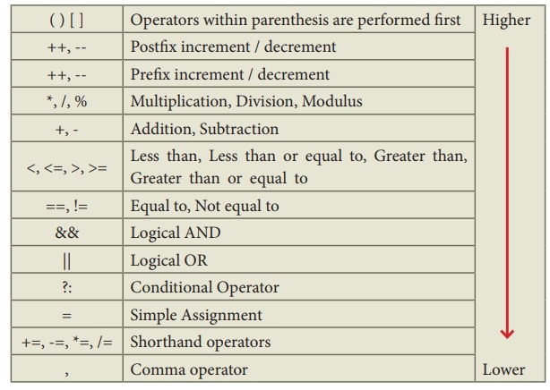
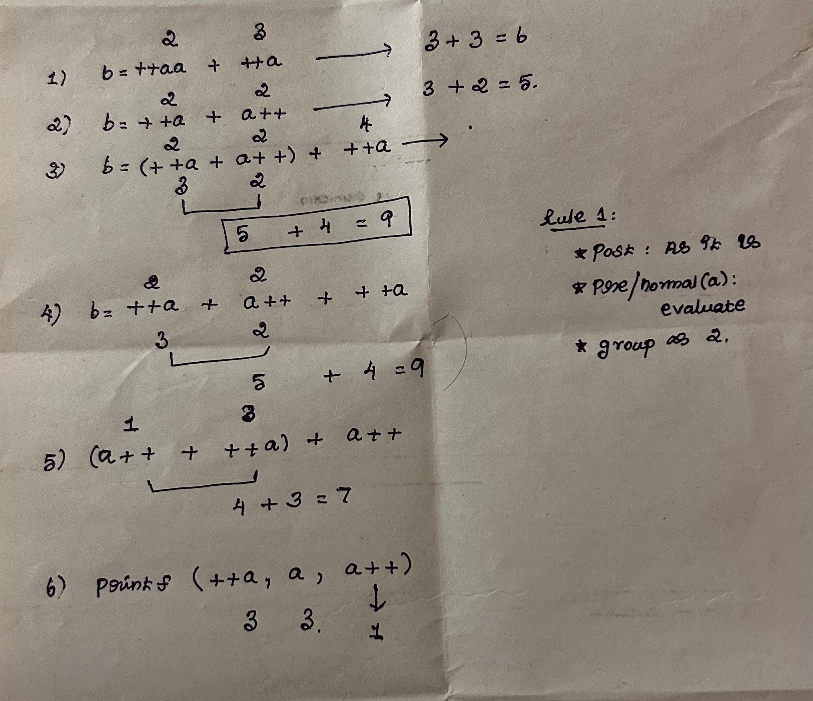
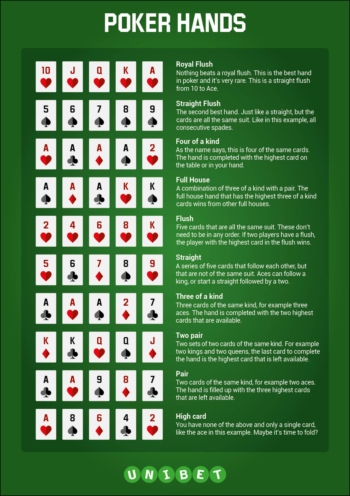

#   C programming

----------------------------------------------------------------
##   C programming basics:
-   Who introduced hello world: Brian kernighan - canadian computer scientist
>   The only way to learn a new programming language is by writing programs in it. 
>   The first program is the same for all programming languages: display the two words
-   C programming language is a general-purpose, procedural, imperative computer programming language developed in 1972 by Dennis M. Ritchie at the Bell Telephone Laboratories to develop the UNIX operating system.
-   C: compile -> load(memory) -> run -> find o/p
-   software: tells hardware what to do!
-   algorithms: set of instructions (recipe)
-   **errors:**
    -    syntax error: grammar mistake (missing semicolon, unknown keyword: violate rules of c)
    -    logical error: wrong output (wrong formula)
    -    runtime error: error during execution (divide by zero)
    -    semantic error: wrong meaning (interpretation: statement not meaningful to the compiler: a + b = c;)
    -    linker error: linking error (missing library)
    -    warning: potential error (unused variable)
    -    fatal error: program crash (missing header file)
    -    exception: error handling (divide by zero)
-   **comments:**
    -    single line: //
    -    multi line: /* */
-   **keywords:**
    -    auto, break, case, char, const, continue, default, do, double, else, enum, extern, float, for, goto, if, int, long, register, return, short, signed, sizeof, static, struct, switch, typedef, union, unsigned, void, volatile, while
-   **Basic components of a c program:**
    -    preprocessors directives: #include <stdio.h>
    -    main function: int main() { }
    -    variable declaration: int a;
    -    executive statements: printf("Hello world");
    -    return statement: return 0;
-   **variable names:**
    -    must start with a letter or underscore
    -    good practice: don't use symbols, special characters, spaces
    -    meaningful, logical, simple, clear: snake case

##   Format specifiers:
-   %d: integer, %f: float, %c: character, %s: string, %lf: double, %u: unsigned int, %ld: long int, %lu: unsigned long int, %lld: long long int, %llu: unsigned long long int, %x: hexadecimal, %o: octal, %p: pointer, %e: scientific notation, %g: float or double, %i: integer, %n: number of characters printed so far
-   %s: prints up to the null character (\0)
-   **Escape sequences:**
    -    \n: newline, \t: tab, \b: backspace, \r: carriage return, \a: alert, \v: vertical tab, \f: form feed, \0: null character, \': single quote, \": double quote, \\: backslash
-   precision:
    -    %5.2f: 5 characters wide, 2 decimal places
    -    %*.*f: dynamic width and precision
    -    %*f: dynamic width
    -    %.*f: dynamic precision
    -    %*.*s: dynamic width and precision

##   Type Conversion:
-   **Implicit conversion:**
    -    automatic conversion by the compiler
    -    int -> float -> double
    -    char -> int -> float -> double
-   **Explicit conversion:**
    -    manual conversion by the programmer
    -    (int) 5.5 -> 5
    -    (float) 5 -> 5.0
    -    (char) 65 -> A
    -    (int) 'A' -> 65

##  Array:
```
    int myArray[4] = {0}; // first element alone 0
```

##   **Functions:**
-   **Function prototype:**
    -    return_type function_name(data_type parameter1, data_type parameter2, ...)
         -    int add(int a, int b);
    -    int add(int, int); // function declaration
    -    int add(int a, int b) { return a + b; } // function definition
    -    int main() { int sum = add(5, 5); printf("%d", sum); return 0; } //call function
-   **Arguments:**
    -    actual arguments: values passed to the function
    -    formal arguments: variables in the function definition
    -    **pass by value:**
        -    actual arguments are copied to formal arguments
        -    changes in formal arguments do not affect actual arguments
    -    **pass by reference:**
        -    actual arguments are passed as addresses
        -    changes in formal arguments affect actual arguments

```c
Increment / decrement operator 
    * right to left evaluation, 
    * post increment -> evaluate as it is!, 
    * Then pre increment: done atlast): see order of execution

> b = ++a + ++a;  
evaluate (2, 3) -> now read from right to left -> 3 + 3 = 6

> b = ++a + a++; (2, 2 (later 3)) -> (3 + 2) = 5

> b = (++a + a++) + ++a; (2, 2 (later 3), 4) -> (3 + 2) -> evaluate to 5 + 4 = 9

> b = ++a + a++ + ++a; (2, 2, 3) -> (3 + 2) -> evaluate to 5 + 4 = 9

> b = (a++ + ++a) + a++; 1 + 4 + 3 = 7

> printf("%d %d %d", ++a, a, a++); // 2 2 2(after 3) -> print 3 3 1

```



##   **Computer architectures**
-   **Von Neumann architecture (modern computers):**
    -    even before used by John eckert and john william mauchly -> BIG ENIAC computer
    -    concept: split computer architecture into 4 distinct parts   
    -    stored program concept
    -    program and data stored in the same memory
    -    sequential execution of instructions
    -    **Components:**
        -    ALU: arithmetic and logic unit
        -    CU: control unit
        -    MU: memory unit
        -    I/O devices
    -    simple, easy to understand, easy to implement, easy to program
    -    eg: read 1 st value from memory, 2nd value from memory. add 2 values, store it in memory, return it
    -    modern architecture: direct communication b/w i/p and o/p: no need for CPUs intervention
         -    DMA: Direct memory access (hardware feature, no need for CPU - directly to and from memory)
         -    DMA controller: manages DMA operations
         -    working:
              -    I/O device requesting transfer
              -    CPU initiates DMA by providing source, destination addresses, data size, transfer mode (read/write)
              -    DMA controller takes control of the system bus (bus mastering), CPU is idle (perform other tasks)
              -    once data is transferred, DMA sends an interrupt to the CPU (notify operation is done)
-   **Harvard architecture:**
    -    separate memory and data buses for program and data
    -    parallel execution of instructions (CPU can fetch program and access data at the same time)
    -    **Components:**
        -    ALU: arithmetic and logic unit
        -    CU: control unit
        -    MU: memory unit
        -    I/O devices
        -    separate program memory and data memory
    -    **Advantages:**
        -    parallel execution of instructions
        -    faster execution, avoid conflicts and bottlenecks
        -    more efficient
        -    **Disadvantages:**
        -    complex and cost is high
        -    **eg:**
            -    read 1st value from program memory, 2nd value from data memory
            -    add 2 values, store it in data memory, return it
-   von neumann is used in general purpose systems, harvard is used in embedded systems (DSP, microcontrollers)

##  Memory representation:

-   OS: manage memory and addresses (how computer knows where the data is stored)
-   address: 8 bit (hexadecimal: 0-9, A-F)
-   word: fundamental unit of data (group of bits): moved b/2 RAM and processor
-   modern computers use 64 bits for a word
    -    For higher bit words: design registers, data buses, memory addresses: handle that many bits at a time
    -    In a 64 bit (2^64) addresses are possible (16 exabytes - very big - future scalable)
    -    why not higher word size:
         -   No need for higher word size: 64 bits is enough, 
         -   complex CPU design, wider buses, more energy consumption
-   Hardware: RAM (volatile) and ROM (non-volatile)
-   **Memory:**
    -    stores data and instructions
    -    **Types:**
        -    primary memory: RAM, ROM
        -    secondary memory: hard disk, pen drive
    -    **RAM:**
        -    random access memory (volatile memory - temporary storage)
        -    stores data and instructions
        -    **Types:**
            -    SRAM: static RAM (faster, expensive, used in cache memory)
            -    DRAM: dynamic RAM (slower, cheaper, used in main memory)
        -    **Working:**
            -    stores data and instructions
            -    For execution of programs - RAM is used (values are stored - read/written from RAM)
            -    **Advantages:** faster access, temporary storage
            -    **Disadvantages:** volatile, expensive
            -    **eg:**
                    -    read 1st value from RAM, 2nd value from RAM
                    -    add 2 values, store it in RAM, return it
    -    **ROM:**
        -    read-only memory, non-volatile memory, stores firmware
        -    **Types:**
            -    PROM: programmable ROM
            -    EPROM: erasable programmable ROM
            -    EEPROM: electrically erasable programmable ROM
            -    **Advantages:** non-volatile, permanent storage
            -    **Disadvantages:** slower access, expensive
            -    **eg:**
                    -    read 1st value from ROM, 2nd value from ROM
                    -    add 2 values, store it in ROM, return it
    -    **Cache memory:**
        -    temporary storage
        -    stores frequently used data and instructions
        -    faster access
        -    **Types:**
            -    L1 cache: level 1 cache (fastest, smallest)
            -    L2 cache: level 2 cache (slower, larger)
            -    L3 cache: level 3 cache (slowest, largest)
-   **C programs:**
    -   Allows low level memory access: efficient, speed and optimizations possible (using pointers access memory)
    -   Size of data type: (may vary with computers)
        -   char c = "/0" -> 1 byte
        -   int i = 5 -> 4 bytes
        -   float f = 5.5 -> 4 bytes
        -   double d = 5.5 -> 8 bytes
        -   char listChar[5] = {'a', 'b', 'c', 'd', 'e'} -> 5 bytes
    -   Finite memory - large numbers (be careful overflows or underflow)

##  Blocks:
-    **Block:**
     -    group of statements enclosed in curly braces
     -    **Types:**
          -    global block: outside all functions
          -    local block: inside functions
```
int main() 
{
    int a = 5; 
    { 
        int b = 5; // cannot access b outside this block
    } 
    return 0; 
}
```

##  Pointers:
-    variable that holds addresses (4 bytes: 32 bits computer, 8 bytes: 64 bits computer)
-    referencing: &a (address of a), *addressOfA (value that address of a holds/points to)
-    array is a pointer (name of array holds pointer to the first element of the array)
-    pointer arithmetic:
     -   operations:
         -   address + 1: next address
         -   address - 1: previous address
         -   address + n: nth address
         -   address1 - address2: difference b/w 2 addresses
         -   address1 > address2: address1 is greater than address2
     -   arithmetic:
         -   array + 1 -> if int array: 4 bytes (next element)
         -   array + 2 -> 8 bytes (2nd element)
         -   *(array + 1) = 5;
```c
    int a = 1;
    int *addressOfA = &a; // store address of a in addressOfA
    int **addressOfAddressOfA = &addressOfA; // store address of addressOfA in addressOfAddressOfA
    int ***addressOfAddressOfAddressOfA = &addressOfAddressOfA; // store address of addressOfAddressOfA in addressOfAddressOfAddressOfA
``` 
```c
    int * addressOfA = &a; // store address of a in addressOfA
    int b = *addressOfA; // store value of a in b
    
    int *arrayPointer = array; (as array itself a pointer to the first element)
    
    &arr[0] = arr
    &arr[1] = arr + 1
    &arr[2] = arr + 2
    &arr[3] = arr + 3
    
    array of pointers:
    short a[3] = {1, 2, 3};
    short *p[3] = {&a[0], &a[1], &a[2]};
    
    p[0] -> pointer of a[0] -> p[0][0] -> 1
    
    array of array means -> array of pointers
    int array1[3] = {1, 2, 3};
    int array2[3] = {4, 5, 6};
    int array3[3] = {7, 8, 9};
    int a[3][3] = {array1, array2, array3};
    
    a[0] -> array1 -> a[0][0] -> 1
    (*(*a)) -> 1
```

##  Dynamic memory allocation: 
-   Allocate memory at runtime (heap), persist in user managed heap (stdlib: malloc, calloc, realloc, free)
-   Not exactly allocated -> as need to include meta bytes also (how subsequent calls of malloc knows - how much free space is available)
-   based on architecture - allocates in multiples of 4,8,16 bytes + meta
-   calloc: allocates with 0 (initiates)
```c
    (returns pointer)
    malloc(sizeof(int)); // allocate memory for 1 int
    malloc(5 * sizeof(int)); // allocate memory for 5 int
    calloc(5, sizeof(int)); // allocate memory for 5 int
    
    free(pointer); // free memory - won't destroy/ delete the memory -> just mark it as free
    can access the freed memory (good compiler - throws warning) -> no guarantee on value
    
    (int*) malloc (sum* sizeof(int)); // typecasting -> as malloc returns generic pointer
```

##  Struct
-   . : member selection operator (group related info together)
-   Arrow pointer:
    -    dereference struct (-> has higher order of precedence than &, no need for parentheses)
    -    studentStructPtr -> firstName
-   Size of struct in memory:
    -    atleast greater than adding up all data types
```c
    struct student
    {
        int roll;
        char name[20];
        float marks;
    };
    
    struct student s1 = {1, "John", 99.9};
    struct student s2 = {2, "Doe", 98.9};
    
    struct student s3;
    s3.roll = 3;
    strcpy(s3.name, "Jane");
    s3.marks = 97.9;
    
    struct student s4 = s1; // copy s1 to s4
    
    
    pass struct to function: (passed by value - not reference)
    void display(struct student s) 
    {
        printf("%d %s %f", s.roll, s.name, s.marks);
    }
    
    pass by reference:
    void display(struct student *s) 
    {
        printf("%d %s %f", s->roll, s->name, s->marks);
    }
    display(&s1);
    
    return struct: copied to the calling function 
```

##  Different way to define struct:
-   Struct itself is not a type tag (typedef is)
```c
Method 1:
    struct student
    {
        int roll;
        char name[20];
        float marks;
    };
    
    struct student s1 = {1, "John", 99.9};
    
Method 2:
    struct
    {
        int roll;
        char name[20];
        float marks;
    } s1 = {1, "John", 99.9};
    
Method 3:
    typedef struct
    {
        int roll;
        char name[20];
        float marks;
    } student;
    
    student s1 = {1, "John", 99.9};
    
Method 4:
    typedef struct student
    {
        int roll;
        char name[20];
        float marks;
    } student;
    
    student s1 = {1, "John", 99.9};
```
```c
    struct assignment
    
    *point p = {3,4} -> ordered (x = 3, y = 4)
    *point p = {.x = 3, .y = 4}
```

##  Other uses of type def (alias type name)
```c
    typedef unsigned char rgb_type;
    rgb_type red, green, blue;
    rgb_type getRed();
```

##  Enum
-   Enumerated data type (user-defined data type)
-   List of named integer constants
```c
    enum days {sun, mon, tue, wed, thu, fri, sat};
    enum days today;
    today = sun;
    printf("%d", today); // 0
    
    enum threat_level_t {
        LOW = 1,
        MEDIUM = 5,
        HIGH = 10
    } // if not mentioned -> 0,1,2
```

##  Constants:
```c
    int a = 12, b = 1;
    const int *p = &a; 
    p = &b;
    printf("%d", *p);
    
    // allowed to change a = 100, not allowed: *p = 100
    // allowed to change p = &b.
    
    Note: can change the value of p but not the value it points to via the pointer  
```

##  Memory checking tools
-   val grind : compiler options -fSanitize=address

##  Graphs
-   scatter plot: relation b/w 2 variables (patterns)
-   histogram: exam score (shape of distribution)
-   line chart: average temperature (trend) - 10 years
-   pie chart: market share (proportion)
-   bar chart: sales (comparison)
-   box plot: distribution of data (spread, median, outliers)


##  **Rectangle program:**
-   Top-down design: put things separated
```c
    logic: (2 rectangles: intersect) -> r1 wider than r2, r1 taller than r2
        left = max(r1-> left, r2-> left)
        right = min(r1-> right, r2-> right)
        top = min(r1-> top, r2-> top)
        bottom = max(r1-> bottom, r2-> bottom)
    
    typedef struct{
        float left, bottom, top, right;
    }rectangle;
    
    rectangle intersect(rectangle r1, rectangle r2)
    {
        rectangle r;
        r.left = max(r1.left, r2.left);
        r.right = min(r1.right, r2.right);
        r.top = min(r1.top, r2.top);
        r.bottom = max(r1.bottom, r2.bottom);
        return r;
    }
    
    float min(float a, float b)
    {
        return a < b ? a : b;
    }
    
    float max(float a, float b)
    {
        return a > b ? a : b;
    }
    
    int main()
    {
        rectangle r1 = {0, 0, 2, 2};
        rectangle r2 = {1, 1, 3, 3};
        rectangle r = intersect(r1, r2);
        printf("%f %f %f %f", r.left, r.bottom, r.top, r.right);
        return 0;
    }
```

##  Compilation:
-   Recompile every file (lot of source files) -> lot of time
-   solution: manually pick, use make (need some file -> recompile changed file alone and relink)
```
    > make
    > ./program
    > emacs file.c
    > make (only changed files alone compiled)
    
    use atleast
    -Wall -Wsign-compare -Wwrite-strings -Wtype-limits -Werror
```

##  Testing:
-   **Black box testing:**
    -    test the program without knowing the internal logic
    -    test the program based on requirements
    -    **Types:**
        -    equivalence partitioning: divide input into groups
        -    boundary value analysis: test the boundaries
        -    decision table testing: test all possible combinations
        -    state transition testing: test the state transitions
    -   **Advantages:**
        -    easy to test
        -    no need to know the internal logic
    -    **Disadvantages:**
        -    not thorough
        -    may miss some bugs
-   **White box testing:**
    -  test the program based on internal logic
    -  test the program based on code
-   use assert (check something is true and abort)
-   **Unit testing:**
    -    test individual units of code
    -    test the smallest unit of code
    -    **Types:**
        -    function testing: test functions
        -    module testing: test modules
        -    class testing: test classes
        -    method testing: test methods
    -    **Advantages:**
        -    easy to test
        -    easy to debug
    -    **Disadvantages:**
        -    time-consuming
        -    need to test all units

##  Buffer overflow:
-   Check for i/p: say expecting 10 characters -> if more than 10 -> buffer overflow
-   customer can enter any commands -> vulnerability
-   memory leak: lose all references - block memory (can't be used by others, still not free by program)
-   double free -> also caused error (undefined behavior)


## Exercise: poker game simulation
