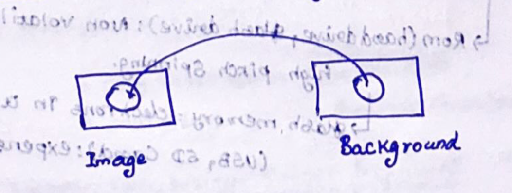
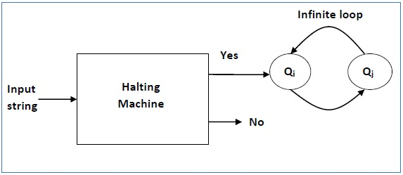

# Computer:

-   powerful, mass data, speed, runs the algorithm
-   not creative, insightful about problem

# Hardware:

-   General purpose technology:
    -   transistors(building block)
    -   chip - nail sized silicon (billions of transistors)
    -   CPU : computing part (2 billion operations per second)
    -   memory (RAM - non persistent (temporary storage for computing), ROM - persistent), flash
    -   ROM: hard drive (magnetic pattern, high spinning), flash drive
    -   mother board has heat sync, CPU, memory
    -   micro-controller: small computer (cheap) - CPU, RAM, storage
-   modern computers:
    -   no moving parts (chip, transistors)
    -   every 18-24 months : transistor count doubles - moore's law - fit more transistors in the same space, more computing power, cheap
    -   Moore's law is not scientific

# Software:

-   code: pieces of instructions running on hardware
-   separate memory between softwares (native code: X86 family has own machine code) : firefox
-   CPU: fetch, decompress and execute cycle (copy into RAM, start execution)
    -   [intel core: I3, I5, I7, I9] [AMD: ryzen, athlon]
    -   multi core:
        -   idea: can't make faster anymore: have more in count
        -   photo processing, weather simulation
        -   super computers: millions of cores
    -   GPU:
        -   3d graphics, games, editing, AI, neural networks, bitcoin mining
-   operating system:
    -   sandbox - isolate programs, allocate resources, manage, supervise
-   Languages:
    -   high level (string, loop, DS) -> low level machine code
    -   compiler (source to machine code / native (.exe, .c))
    -   interpreter (dynamic, 1 line at a time : execute), convert to an intermediary code, at run time convert to machine code
    -   compiler is faster, less overhead / decisions, lean
    -   interpreter (dynamic): productive, slow code : tradeoff (programming easy but slow running)
        -   CPU is cheap but developers are not
    -   JIT: connect both worlds - compile frequent codes, discard when exited, even reducing 10X penalty, still not fast as compiled ones
-   virtual memory:
    -   allow additional programs that it can run (virtual memory)
    -   abuse: performance will be poor
    -   old:
        -   can't load many programs (only 1 at a time)
    -   current:
        -   load more, use at a time, switch
        -   even loaded many, can't use at a time (so enough resources!)
        -   frequently used alone in RAM, else in ROM (virtual memory)
        -   when required: move to RAM, unnecessary program: move to virtual memory
    -   RAM > SSD > HDD > Magnetic disc (speed increases, cost increases)
    -   pretend virtual memory as main memory, but when everything is used - lot of context switching (Thrashing)
    -   Thrashing
        -   spend time moving back and forth (RAM & virtual memory) -> best buy memory

# Bit and Bytes

-   Bit: 0/1 state (switch), group 8 bits: 1 Byte ($2^n$ states) : 0 to 255
-   KB: 1024 bytes, 1MB: 1024 KB, 1GB: 1024 MB, 1TB: 1024 GB
-   Gigahertz: speed (not bytes): 1 billion cycles per second, faster the speed - higher the cost, higher the CPU computation performance, more heat
-   cycle: rate at which CPU can do its simple operation/sec
-   1000 system: kilobyte, 1024 system - kibibyte, mebibyte
-   5% error between the two systems

# Binary addition:

-   1 + 1 = 10, 11 + 1 = 100 ($2^n$ combinations)
-   2 bytes (16 bits) -> ($2^{16}$ = 0 to 65535)
-   overflow:
    -   1 st (MSB) digit: sign bit
    -   65535 + 1 -> a negative number
    -   1111 1111 + 0000 0001 = 1 1111 1110
    -   account only 8 bits (bit before it - ignored/discarded)
-   Binary floating numbers
    -   1/10 = 0.1 (decimal) = 0.0001100110011... (binary) = 0.00011 (binary)
-   Ascii
    -   A = 65, null = 0
    -   start of heading = 1, start of text = 2
    -   end of text = 3, bell = 7, backspace = 8, tab = 9, return = 13

why binary/text:

-   while using text -> system encodes using unicode / other encoding schemes and transmits (mac, windows uses different symbols for very few symbols)
-   avoid this transmit as binary (bits)

# colors:

-   pixel: smallest fundamental unit for the representation of colors
-   RGB: color coding representation used in computers (normally)
    -   R: Red, G: Green, B: Blue (3 Bytes)
    -   web safe colors: 216, 148 named colors
    -   2^8 _ 2^8 _ 2^8 = 17.6 million combinations
    -   (0,0,0): black, (255,255,255): white
-   Greyscale
    -   when all the R, G, and B have the same intensity (the lower the intensity, the darker the greyscale image)
    -   0,0,0 -> pure black, (255,255,255) -> pure white
    -   (50,50,50): dark grey, (120,120,120): medium grey, (200,200,200): lighter grey
-   Regular to greyscale image
    -   Take the average of R, G, and B : (R + G + B) / 3
    -   assign it to all the R, G, and B
-   Is reddish
    -   when R > 150 (some threshold) - doesn't mean red
    -   (255,255,255): means whitish not reddish
    -   find: take average
        -   when red is way more than the average, only reddish (1.1 times, 1.5 times,...)
-   Change to hexa-decimal:
    -   RGB: 1000 1100, 0001 0101, 0001 0101 -> 8c1515
    -   hexa-decimal: 0-9, A-F (16 symbols)
    -   usage: IPv6, network physical address, memory
-   Blue screen effect:

    -   record in a blue screen or green screen -> replace the actual image with the background image
    -   Videos : series of still images (20 - 60 images per second)
    -   Algorithm:
        -   detect red pixels
        -   for each (x,y) pixel in the image target, replace the corresponding pixel in the background image
        -   maintain adjacent pixels
    -   Python:

        ```python
        from simpleimage import SimpleImage
        front_image = SimpleImage("skop.png")
        back_image = SimpleImage("back.png")

        for pixel in front_image:
          avg = (pixel.red + pixel.green + pixel.blue) / 3
          if pixel.green > 1.5 * avg:
            x = pixel.x
            y = pixel.y
            back_pixel = back_image.get_pixel(x, y)
            pixel.red = back_pixel.red
            pixel.green = back_pixel.green
            pixel.blue = back_pixel.blue

        front_image.show()
        ```



# Images

-   pixel: unit (resolution: how many pixels per inch)
    -   VGA: 640 \* 480
    -   Television: 640 \* 480
    -   Ultra wide: 3440 \* 1440
    -   HD: 1920 \* 1080 (standard)
    -   4K: 3840 \* 2160
-   Aspect ratio = width / height
-   black box: when resolution doesn't matches: black screen appears
-   RGB (mix - generate 16.7 Million color combinations - 3 Bytes) [0-255]
-   RGBA: RGB + alpha (transparency) -> 16.7 M colors + 256 levels of opaque / transparency
    -   when 4 bits : $2^4 * 2^4 * 2^4$ = 4096 colors
    -   In CSS: can mention as % -> RGB(100%, 32%, 21%), RGB(200,12,14), RGBA, HSL-HUE : saturation, lightness
-   2160P:
    -   P: progressive (old: update odd lines in odd second 1,3,.. : even lines in even seconds 2,4,...)
        -   Interlaced (old): 30 seconds: odd lines (1st 1/30 th second), even lines: (2nd 1/30 th second)
        -   progressive: update every line at once (All new televisions are progressive)
-   UHDTV: Ultra High Definition TV - higher pixels per inch
-   HDR: High Dynamic Range (high pixels per inch, better contrast - difference b/w dark and light colors), 10 Bit per color ($2^{10} * 2^{10} * 2^{10}$ = 1 Billion colors)

# printer vs screen:

-   printer: subtractive color (paint) - CMYK
    -   white light absorbs paints, what remains is what we see (subtract)
-   screen: additive color (RGB)
    -   add colors to get colors (mix 255 of R,G, and B to get white)

# save images (Bitmaps vs objects):

-   bitmap: As grid (0,0): (255, 11, 234) -> 9216 bytes
    -   JPEG, PNG, GIF, RAW (higher end cameras), HEIC (apple)
-   object: As object : center (11,11), radius: 8px, stroke: 1px, color: rgb (255,0,0) : only geometry (entire)

# Networking

-   Network: a group of interconnected devices
-   Internet: a global network of interconnected computers
-   Bridge: connect 2 different networks of the same type of topology
-   Router: connect 2 different networks of difference type of topologies.
-   Terms:
    -   bandwidth: speed of the network (wider frequency: more data carried)
    -   narrowband: telephone line
    -   broadband: just term often used in company names also
    -   Network: LAN, WAN (wide: city, continents), MAN
    -   hop: number of networks passed to reach the destination, more hop more lag
    -   Log and latency: mot reached in time: lag, amount of delay: latency
    -   Use CDN for faster content delivery (web servers)
-   Addresses
    -   MAC (Media Access Control): base 16 Unique - provided by manufactures
    -   00-00-42-AF-3B-05 (00-00-42: manufacturer prefix)
    -   multiple MAC address possible: wifi, bluetooth, ethernet
    -   Use social security number for mailing (won't work) - use building address (IP address)
-   Network topology: the physical or logical arrangement of devices in a network

    -   Bus (Bob met calfe - xerox parc):
        -   minimal hardware, max performance, no central controller, broadband
        -   all computers are connected (unique address), message broadcasted (mac address), intended receiver receives the packet
        -   issue: every computer listens (security), collision
        -   collision:
            -   send at same time: garbled, sender notices collision - stop sending, wait for still time and resend (hard to say how long to transmit)
        -   wifi:
            -   similar to ethernet, air as the medium (radio)
            -   1 computer transmits at a time, everyone listens
            -   insecure, hard to listen and pickup intended packets

-   Network protocols: rules and standards for communication between devices
-   Types:
    -   LAN: small scale, home (ethernet, wifi)
    -   Terminologies:
        -   packets: divide bytes into packets (say 1500 bytes : 32 packets), each packet may have different length
        -   checksum: ensure integrity, detect error
            -   Basic algorithm: just check number of ones
            -   disadvantage: when 2 errors (1 -> 0, 0 -> 1): cancel out
            -   modern algorithm: powerful, detect small error
            -   But always a probability of slightest error

# TCP/IP protocol (1974 - Govt sponsored research)

-   Motivation:
    -   vendor neutral, free, open
    -   standard, followed by all - no conflict (eg: HTTP), agreement on how they are going to carry out a task (actions, type, format, error conditions)
    -   protocol vs program: program understands the protocol, communicates with web servers
    -   Like delivery taken care of fedex, just delegate it to protocols
-   Applications:
    -   Transmission control protocol / Internet protocol
    -   internet is built on top of TCP/IP protocol
    -   171.64.64.166 (4 Bytes): IPV4 (171.64: neighborhood)
    -   domain name: www.google.com (easy to remember), DNS lookup for IP
    -   special IP:
        -   10.x.x.x, 192.168.x.x : given by wifi router internally, no global scope
    -   Problem with IPV4: $2^{32}$ = 4 billion (7.8 billion population)
    -   IP address:
        -   IPV4 - only 4 billion connections (many are reserved)
        -   solution: IPV6 ($2^{128}$ possible connections)
    -   MAC: assigned by manufacturer, IP: By ISP

# Basic layers of the internet:

-   Physical layer (lowest layer):
    -   decide on what frequency going to communicate
    -   each time new network, new physical layer
-   network layer:
    -   internet protocol, decide packet size
    -   attach sender IP, recipient IP, checksum, data in the packet
    -   Best effort to deliver (not guaranteed)
    -   each new network / IP, new network layer
-   transport layer:
    -   TCP/IP: key internet protocol (break in to individual packets, mark source target address, packet number)
    -   receiver end: reorder, ask to resend (missing/corrupted ones)
-   Application layer: (every program)
    -   mail: SMTP, POP, IMAP protocol
    -   web: HTTP
    -   file: FTP, SFTP

# Pocket switching vs circuit switching

-   Earlier dedicated line b/w source and destination - 1 packet at a time
-   someone connects the line (circuit switching)
-   packet switching: (new): efficient, send everyone's packet in the same line
-   note: videos/face call won't wait till the last bit (time consuming) - just show what we have rightn now

# Port number:

-   firewall can turn on/off ports
-   Identify programs running on a computer
-   Browser (80), email reader (143)
-   firewall: control in/out traffic in a network
-   browser uses shared ephemeral port assigned by system (80 used by chrome, firefox uses another one provided by system)

# Router

-   Router: device that connects multiple networks, copies / routes packets
-   Routing table: table that stores information about the network
-   1 to n hops: identify shortest path (each router next path, no need to solve the entire path) - functionality, no breakage, reliable path
-   At the destination, the router puts back all the packets in the order (ask resend if required)

# Being on the internet:

-   connect to a router (get an IP - DHCP protocol)
-   DHCP: Dynamic host configuration protocol - auto configure network settings to work locally, establish temporary connection, allocate an IP
-   utilities:
    -   ping: send ping packets, check reply - functioning?, see hops
    -   traceroute: see hop route - not entirely reliable (some hops invisible)

# Analog vs Digital

-   Analog: continuous, digital: discrete (bits)
-   world: analog (wave over time) - sound (vibration, push ear drum, recreate signal)
-   oscilloscope: show the electrical signal over time in a screen (y - voltage, x - time)
-   note: 1/400 th a second
    -   (middle A: 440 cycles/sec)
    -   (higher A: 880 cycles/sec)
    -   (even higher A: 1760 cycles/ sec)
-   amplitude: how high/low
    -   when match up (positive - positive) -> add up (cord)
    -   when mismatch (positive - negative) -> cancel out (dissonant/ discord)
-   microphone: record analog vibration and o/p electrical signal which can be recreated by speakers

# sampling

-   measure amplitude at regular intervals (44k samples per second)
-   save in digital format, recreate the sound
-   more samples, more accuracy
-   intelligent way to store
    -   store differences alone (less bytes): 12000, +2, -2, -4 (compression)
    -   drop every other number (get average) - save 2X but lousy
    -   MP3 - lousy algorithm, 10X less space

# digital media

-   web compatibles:
    -   HEIC: only apple, not web compatible
    -   WebP, WebM: google - half of we browsers don't support
    -   JPEG, PNG, GIF, SVG: widely supported
-   compression:
    -   write into memory : prefer q7
    -   aggressive compression: when less space / limited bandwidth
    -   web page - when more (loading issues), q2/q3 compression: bad
        -   less is good, combine into a single image - use
-   Image:
    -   JPEG:
        -   Mainly for storing photos
        -   free standard (lossy): widely used, less detail preserved
        -   compression/quality scale: 0 to 10
        -   8 \* 8 blocks : high compression -> crisp edges b/w boundaries, noise, distortion
        -   q1: 4 times less bytes than q7
            -   400 \* 300 pixel image: 120k pixels (3Bytes - each pixel): 360 KB
            -   when width is doubles, area is quadrupled (multiply by 4)
            -   JPEG saves space, used by cameras internally
    -   GIF, PNG:
        -   lossless image format (exact recording of pixels)
            -   preferred for non-photographic images
            -   used for web graphics, icons, logos
            -   GIF: partially patented, PNG: free, open, better than GIF
        -   PNG:
            -   built on top of GIF (diagram, graphics): hand / computer (q0-q10 compression levels)
            -   Not efficient for photographs (PNG: Not lossy)
            -   can make individual pixels transparent
        -   GIF:
            -   only 256 basic colors only - pixelated
-   Audio:

    -   Sound:
        -   stereo: 2 microphones (record sound)
        -   Bit depth: min max amplitude (greater the sampling and depth - greater the quality and accuracy, larger the size)
        -   Digital music:
            -   5 min _ 60s _ 41.1k samples / sec _ 2 channels _ 2 bytes = 50MB / min (uncompressed)
    -   MP3:
        -   lossy like JPEG (10MB/minute no compression) -> 1MB/minute or even 512 MB/min (compression rate : q0 to q10)
        -   patented (complex, non obvious technique) - till day software companies pay for license
        -   Logic:
            -   Fast fourier transform - get individual frequencies
            -   psychoacoustics: Remove frequencies that are not audible (human hearing range)
            -   huffman coding: store high frequency codes (encode)
            -   MP3: standard: 4.5MB/5min (5min _ 60 _ 128 Kb/s = 38400 Kb)
    -   AAC:
        -   used by apple: ipod, itunes
        -   digital right management feature: control buyer how the content is used
    -   ogg vorbis:
        -   free, open, royalty free - better than MP3
    -   FLAC: Free Lossless Audio CODEX (ALAC: apple, WMAL: windows)
    -   comparison: (5min audio)
        -   FLAC: 35.67 MB
        -   MP3: 4.5 MB
        -   CD: 50.47MB
    -   MIDI file (store notes)
        -   Helpful for music composers - more info (velocity, vibration)
        -   Less space (manipulate notes)

-   video formats:

    -   MPEG:
        -   20 to 60 still images (lots of bytes)
        -   DVD quality - 2GB/hour, HD: more space
        -   video compression: complicated, heavily patented
        -   MPEG: industry standard, MPEG-LA: handles royalty payments
        -   MPEG2: satellite, DVD [1995 - released]
        -   MPEG4 (h.264) compression: good looking, max compression
            -   blue ray discs, video cameras
            -   internal compression
            -   patent fee: manufacturer pays for encoder and decoder
            -   obnoxious royalty - can't distribute own video (pay additional royalty for each extra minute, exception: free distribution)
    -   WEBM open:
        -   mozilla, wiki, google : true, free, open video code (compete h264) : WEBM project
        -   MPEG-LA claims used patented tech - but unable to prove

-   video tags and flash video

    -   HTML5 supported embedded video tag
    -   flash plugin (OS wise): windows better but for other platforms worse
        -   macos crashed mostly due to adobe flash, customers blamed macos
        -   adobe and apple are competitors, how adobe will fix?
        -   Apple rewrites: TCP/IP, HTML, HTTP, JPEG, PNG

# Computer security

-   spear fishing:
    -   intended/crafted for an individual
-   spyware:
    -   spy (access to accounts, copy files, control microphone, camera, keyboard log, track movement)
-   Ransomware:
    -   ask payment to decrypt
-   Adware:
    -   display ad without providing service, trojan horse sometimes
    -   mine crypto (ad-related)
-   Zombie computer:
    -   remote user access (use for spam, DOS, fraud)
-   Logic bomb:
    -   original user done / injected malware
-   dictionary attack:
    -   attack using common passwords
    -   prevent: policy: slow password validations
    -   password: word, misspelling, random letters, case, symbols, no reuse
-   phishing:
    -   email/sms replicate - fraud (fool/impersonate)
    -   real world: atm (error paper, record pin, atm number)
-   Eaves drop / man in the middle attack:
    -   prevent: https, don't connect to open wifi, encrypt
    -   listen to neighbor packets (broadband)
-   malware attacks:
    -   malware - common word
    -   .txt, .jpg: static/passive content(can trust)
    -   .exe, .zip, .rar: active content (can't trust)
    -   word, sheet, pdf - may have embedded scripts
-   virus:
    -   attach to other programs, execute: zip files can include .exe files
    -   word may have scripts
-   worms:
    -   propagate copies of itself on a network
-   trojan horse:
    -   claim something, do something else
-   zero day exploits:
    -   exploit unknown weakness
-   incidents:
    -   bug in adobe - crash

# Attack vectors:
-   social engineering: ignore tech aspects, aim for weak spots, gain more info
-   phishing: email(get data), manipulate reply-to, SMTP (anyone can use), replicate a brand
-   spear phishing: learn about job, team, co-workers, hack them and do harm
-   drop USB (plug in, hacked)
-   SQL injection: encode, sanitize
-   cross site scripting: webpage injected 
-   click jacking: web server side - block iframes - header
-   sandbox security: client program: only allowed within
-   drive by download: plugin/program
-   man in the middle: fake wifi, certificate authority
-   dev dependencies (inherit vulnerabilities)
-   open source code / IP protocol / libraries (inherit vulnerabilities)

# Defensive techniques:
-   encryption: protect data
-   firewall
-   proxy servers like VPN
-   Air gap - separate from common internet
-   secure email (No IP record - anonymity)
-   secure password (complex, unique, change)
-   HTTPS
-   disable JS 
-   Use MFA, passphrases, password manager
-   patch software updates regularly, password recommendations, avoid repetitions
-   Antimalware software 

# privacy
-   cell phones can track activity, location
-   CCTV - track location
-   digital consumption (news, magazines), smart cars, smart home
-   Laws:
    -   enough computing power: license plate reading, face recognition, big data
    -   US Law:
        -   practical obscurity - right individual, turn down FBI rap sheet
    -   EU law:
        -   right to be forgotten (except newspaper, search engine - exclude searches)
        -   with in 1/2 year, google 120k requests
        -   China law:2016: GDPR (breach notification, right to access, forgotten)
        -   ensure privacy by design
        -   data protection officers (report to high level management)
        -   penalty up to 4% of world wide income
-   ethics:
    -   not paid (targeted by ads)
    -   google selling ads - where's the line, email tracking beacon, 3rd party cookies
    -   TOR: anonymous routing
    -   Big data: volume, velocity (realtime: low, high: batch processing), variety (data type: structured, unstructured)
    -   TOR: anonymous routing, only last router knows destination


# Network security

-   concerns:
    -   confidentiality
    -   authentication (cryptography - caesar cipher, symmetric and asymmetric encryption)
    -   integrity (hash, checksum)
    -   non reputation
-   asymmetric keys:
    -   mathematically related, can't decrypt without other key (private)
    -   computationally infeasible to derive the private key from the public key
    -   Diffie Huffman algorithm (Turing award, British intelligence govt communication)
-   working:
    -   browser: www.amazon.com (initiate https connection)
    -   amazon server response (TLS/SSL certificate which includes public key, certificate details, CA signature)
    -   browser validates the certificate issued by the trusted CA, not expired, matches the domain
        -   CA (signed directly or intermediate certificate) -> using the public key of the CA validate amazon's response CA certificate
        -   some cases, browser contact CA (check revoked?)
        -   mostly not needed, can't impersonate CA certificate (need private key to sign), so if the public key can decrypt the signature -> yes!
    -   session key generation: browser generates random session key, encrypt the session key using the server's public key from the response certificate from amazon
    -   web server decrypts using the private key, it has the session hash (symmetric key)
    -   from now on, secure communication happens using this session key!
-   public key, private key - server side:
    -   TLS (< 1.2 version - RSA)
    -   TLS (1.3 - diffie hellman key exchange algorithm)
    -   share the public key to browser, it has private key
-   HTTPS initiation:
    -   amazon has private key


# HTML:

-   Origin of the web
    -   Internet + HTML / Hyper text: WWW
    -   Tim Berner Lee (CERN) - way of sharing research papers b/w physicists
    -   problem:
        -   book: index, chapter
        -   internet: how to order nodes, interconnect (speech, text, video, audio)
-   HTML:
    -   HTTP (computer ask for file not mentioning formats)
    -   Hyper text: grammar like human language (syntax, semantics)
    -   markup: where, how it should appear (bold, size) - between containers like <i>
    -   HTML ignores white spaces
    -   head: info about webpage
    -   tags:
        -   text level -> can't have block level tags / other text level tags
        -   block level tags can have other text level tags
-   CSS:
    -   semantics info, markup -> formatting, styling (own rules, semantics - different language)
    -   eg: font-properties (family, font-size)
    -   types: inline, external, internal
-   link webpages:
    -   relative (same folder directory)
    -   absolute (link to access that asset)
-   URL vs URI:
    -   URL: Universal Resource Locator (html.txt) : not recommended
    -   URI: Universal Resource Identifier (/class/physics)
-   CSS pseudo class:
    -   internal class -> a:link, a:hover
-   micro formats:
    -   div with class (use number, print stars) -> class to pick info / filter
-   Layout:
    -   don't use tables (redo if any changes required), nested tables are expensive
    -   float based : tied to HTML, messy issues
    -   flex box : fairly tied but easy to flip, reverse, elements tied to the parent div
    -   Grid : like table but defined in css, placed in css
-   some advanced techniques:
    -   redirect to different pages - different sections of an image
    -   how to achieve: image map
    -   Image sprites:
        -   lot of images - lot of network traffic
        -   make into a single image!

# Control over user device:

-   UI attractiveness, utility: vary with device size
-   tooltip, button size, mouse / pointer size : not supported in every browser
-   Always design for minimum user (user agent, responsive web design)
-   Media queries:
    -   hover (none, hover)
    -   pointer (none, fine, coarse)
    -   width, height, orientation(landscape, portrait)
    -   aspect ratio, color (no of bits)
    -   resolution (dots per inch)

# Human computer interaction:

-   windows, icon, mouse, pointer (GUI)
-   future: AR, VR, speech, gesture, brain interface
-   psychology: how human cognition works (perceive color, limitations of human memory)
-   graphic design, ergonomics, sociology/ethnography(workplace study)
-   UI Design:
    -   observe workspace, process, potential users
    -   task, roles -> prototype, testing, iterations (low fidelity(sketch), high fidelity(working))
-   use cases: (book case)
    -   visitor(who)
    -   purpose of visitor
    -   expertise level
    -   device they have
    -   internet connection
    -   tasks: book, topic, random
    -   potential cx:
        -   young professional (cell phone, good internet)
        -   old (low tech, moderate internet speed)
    -   scenarios:
        -   while commuting - can access the app and search?

# standard web design

-   font:
    -   logo, font-choice:
        -   sans-serif: upbeat, contemporary
        -   serif: formal, authoritative, old fashioned, cloudy
        -   mono-space: code
-   color:
    -   hue: saturation, brightness(HSB)
    -   RGB: computer display colors
    -   formula there to convert HSB <-> RGB
    -   color wheel:
        -   complementary, split complementary, analogous
-   no dead end, consistent navigation

# Python

    -   method: object.method
    -   function: not within an object

# Types of services:
-   IAAS: infra as service - need skilled IT - OS, AWS, setup,...
-   PAAS: computing platform (run software)
-   serverless: amazon lambda
-   SaaS: software as a service (google docs, dropbox)
-   edge, fog, mesh: computing 

# Halting problem:
-   halting test program:
    -   input program
    -   output: true (if ends - goes to infinite loop), false: infinite loop
-   give halting program itself as input
    -   when halts (true -> enters to infinite loop), input to halting test program (infinite loop program): false!
    -   when doesn't halts (false) -> input to halting test program -> true (enters to infinite loop)
-   contradiction:
    -   when halts, end output is false 
    -   when doesn't halts, end output is true
-   idea:
    -   not everything can be solved by computer
    -   The contradiction proves that no single algorithm can reliably decide whether arbitrary programs halt or not. The problem lies in trying to predict the behavior of all programs, which is inherently impossible.

