# computer science:

-   systematic study of algorithmic processes that create, describe and transform information
-   program: set of instructions to computer
-   types of programming languages:
    -   procedural (series of commands)
        -   pascal (1970) - education purpose
        -   C (1972) - low level OS and devices
    -   functional programming (map i/p to o/p)
        -   List (1958)
        -   scheme (1975)
        -   ML (1973)
        -   Haskell (1990)
    -   object oriented
        -   small talk (1980) - first major OOP language
        -   C++ (1985) - improvements to C, used to build OS such as windows
        -   Java (1995) - designed for embedded systems, web apps - many platforms

# compiling and running

-   compiling: translate from one language to another
-   byte code: intermediate code
-   run: execute the program (compile to byte code then execute the byte code)
-   compiling error:
    -   may have syntax errors causing compiling errors

# Naming conventions:

-   class:
    -   capitalize each word
    -   class name same as file name (public classes)
-   Identifier:
    -   legal: start with letter, _ or \$, only letters, number, _ and \$ allowed
-   keywords: reserved words in Java
    -   eg: abstract, boolean, default, int
-   comments:
    -   short: //
    -   long: /\* \*/

# method:

-   group statements (structure), eliminate redundancy (write once, use n times)
-   use loops when repetitions.

# fence problem:

-   fence has 5 posts but 4 wire

# Escape sequence

-   \n: new line
-   \t: tab
-   \b: backspace
-   \r: return
-   \f: form feed
-   \": double quote
-   \': single quote
-   \\: backslash

# Data types:

-   primitives:
    -   int ($2^{31} - 1$)
    -   double (up to $10^{308}$)
    -   char (single text characters)
    -   boolean (logical values)
-   primitive array
    -   int[], int[][] : 1d, 2d, ...
    -   jagged array: rows of a jagged array - don't need to be of the same length
-   data types
    -   cannot have primitive type -> type mentioned while declaring (must be class/object type): Instead of primitive - use wrappers
    -   ArrayList: get, add, remove, clear, size
-   why int vs double:
    -   computers calculate int different than real numbers - calculating efficiency, mechanisms by processors
-   Integer division (no decimal):
    -   32 / 5 = 6
    -   can't divide by 0
-   precedence:
    -   order of evaluation: in general -> left to right
    -   \*, /, % have higher precedence than +, -
    -   example:
        -   1 _ 2 + 3 _ 5 % 4 => 2 + 15 % 4 => 2 + 3 => 5
-   when int, double is mixed -> result will be in double!
-   copy primitive vs reference:
    -   primitive: changing the copied one doesn't affect the one the original one (copied by value)
    -   reference: changing the copied one affects the one the original one (copied by reference). If don't want this behavior use clone().

# Array vs ArrayList

-   Array:
    -   size is static, can't add/remove/insert elements later. No handy methods
-   ArrayList
    -   list of items: index (store: Object type)
    -   resizable, has utility methods

# expressions and operations

-   operators:
    -   Relational: ==, !=, <, >, <=, >=
-   modify and assign:
    -   +=, -=, \*=, /=, %=
-   expression:
    -   (1 + 4) \* 5
    -   simplest expression: 42
    -   complex expressions use parenthesis
-   operator:
    -   combine multiple values / expressions (evaluate)
-   methods can return -> treated as expression
-   = : use to compare primitive types, not reference types. For reference types: use equals()
-   null: special constant meaning: "no object". can use ==, != operators

# variables, scope, class constant and parameter

-   variable in a method - method scope - can't use outside
-   scope: part of a program where a variable exists (declared inside loop, scope: with in loop)
-   class constants: fixed value to the whole program (only declare, can't reassign).
    -   variable name: all upper case
-   parameter: value passed to a method by the caller.
-   argument: declare in the method!
-   working:
    -   when primitive data types are passed, they are copied to the argument variables declared in the method
    -   anything happens at the method, doesn't affect the primitive variables.

# Formatting with printf:

-   %d, %f
-   %.Df: real number, rounded to D digits after decimal
-   %W.Df: real number, W chars wide, D digits after decimal
-   %-W.Df: real number, W wide (left align), D after decimal

# Objects:

-   entity having data (state) and behavior
-   class: blueprint for objects (type/category of objects)
    -   print objects: implement toString method

# Exceptions:

-   object representing a runtime error (divide by zero, null access, read file that doesn't exist)
-   program with an error "throws" an exception, we can catch an exception inside a program -> checked exception

# Graphics, events, animations

-   pixel: each (x,y)
-   x increases rightward, y increases downward
-   (0,0): top left of the screen
-   events:
    -   mouse moved, dragged, pressed, released, clicked, entered, exited
    -   some external stimulus to the program (press keys, timers)
-   event driven programming:
    -   overall execution of the program is dictated by user events
    -   In graphics (java library - extend GraphicsProgram) - write inside a listener event
-   methods:
    -   getElementAt: input: x,y -> return graphical object found at that co-ordinate
    -   GImage pixel methods: getPixelArray(), setPixelArray, createRGBPixel, getRed, getGreen, GetBlue

# Enlarge image:

-   Say 2X (earlier area is 100 means now: 400)

    -   make 2X wide and height: 4X area
    -   1 pixel expand as 4 pixel
    -   (0,0): copy to (0,0), (0,1), (1, 0), (1,1)

    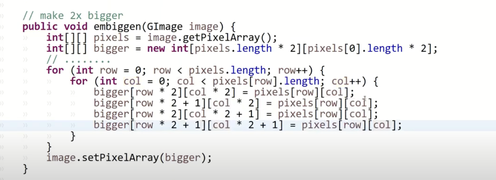

# GUI:

-   modern apps have GUI (components, layout, events): AWT, Swing, Java Fx
-   Java - OS independent (revolution: GUI - no need to write for windows, mac - became popular)
-   elements:

    -   window: graphical desktop: frame, dialog box, applet
    -   component: button, text area, checkbox, label, canvas (controls/interactors/widgets)
    -   container: group for storing components (panel, table, box, scroll pane)

-   libraries: acm.gui, java.awt, javax.swing
    -   GUI: extend Program (not GraphicsProgram : can have GUI, canvas)
    -   init (setup components, wait for events) - create components, load to the window
    -   run: for animation loops, resource loading
        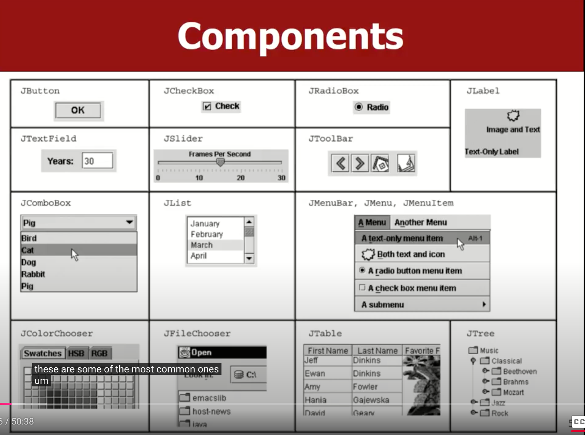
    -   Components:
        -   button: set font for the text, position the button in NORTH, WEST, CENTER, SOUTH, EAST
        -   can set border (line, matte, titled)
            
            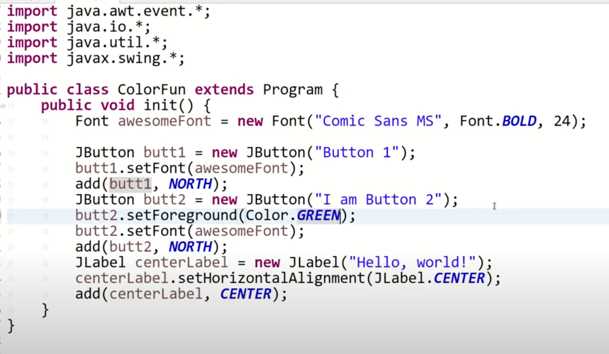
    -   Events:
        -   handle in the method: void actionPerformed(ActionEvent event)
        -   end of init method, call addActionListeners()
        -   by default, no event will occur if you press on a JTextField (change this: add an action listener)
            -   myTextField.addActionListener(this);
            -   myTextField.setActionCommand("bingo);
        -   access:
            -   actionPerformed(ActionEvent event) -> if(even.getActionCommand().equals("bingo))

# Components:

-   button group:
    -   add multiple radio buttons to a group (logical group not a graphical component)
-   GCanvas: 2d graphics, shapes, colors
    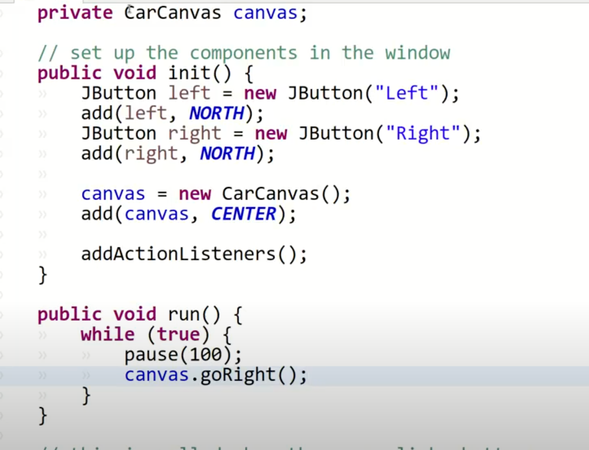
-   Add scroll bars around any other components
    -   new JScrollPane(component);
        -   add the JScrollPane to the window -> not the component (as JScrollPane has the component)
    -   draggable knob, drop-down list, list of selectable items
    -   display dialogue boxes:
        -   JOptionPane.showMessageDialogue(this, "message")
        -   alert("message")
        -   JOptionPane.showConfirmDialog(this, "message")
        -   confirm("message")
        -   JOptionPane.showInputDialog(this, "message")
        -   prompt("message")
-   Layout managers:
    -   decide where to position (grids, pixel wise position)
    -   Program class - acts as a container for holding components
    -   mention preferred size for components
-   composite layout:
    -   containers with in containers

# Inheritance

-   allow class to be based on another parent
-   hierarchies of related classes - reuse code
-   subclass inherits all the attributes and methods of the parent class (super class)
-   call super class' method/field: super keyword
-   If super class has a constructor, subclass must have the same signature of constructor too!
    -   basically the subclass tries to super() -> calls the default constructor!

# Polymorphism:

-   bind data and method (ability for the same code to be used with different types of objects and behave differently with each type)
    -   println: accepts any type of parameter
-   a subclass can hold a parent reference (up reference, then down reference to use!)
    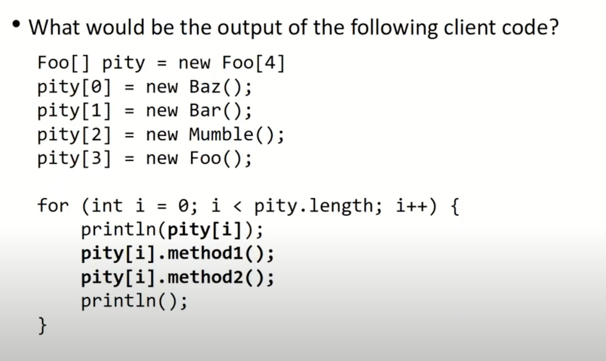
    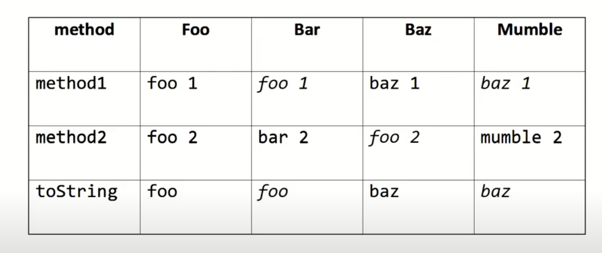

# Critters (small animal) - polymorphism exercise:

-   each animal: getMove (define pattern)
-   eat, fight, getColor, getMove, toString
-   example:
    -   start as white, red: when achieved certain level by fighting (pounce - fighting style), toString: "A"
    -   snake: never eats, forfeit fight always, movement zigzag
        -   1E, 1S, 2W, 1S, 3E, 1S, 4W, 1S, 5E, 1S
        -   logic: when odd: east, even: west
        -   every move: east/west steps + 1 south
-   states: - store states, total moves, eats, direction
    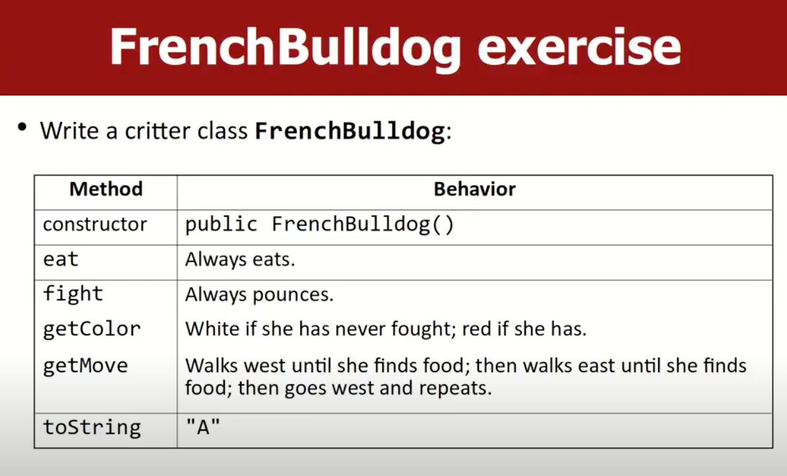
    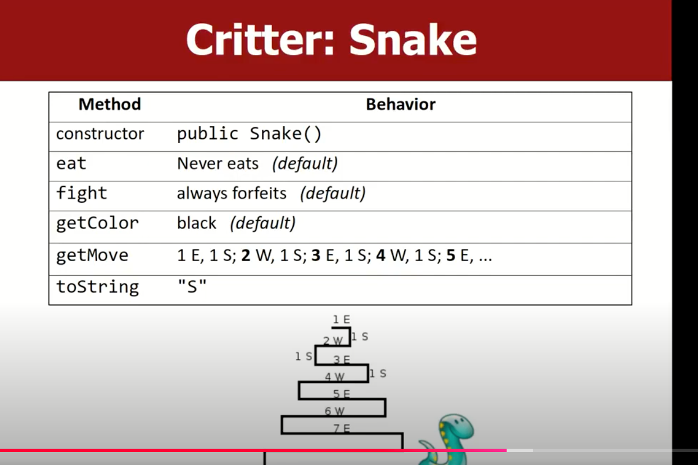
    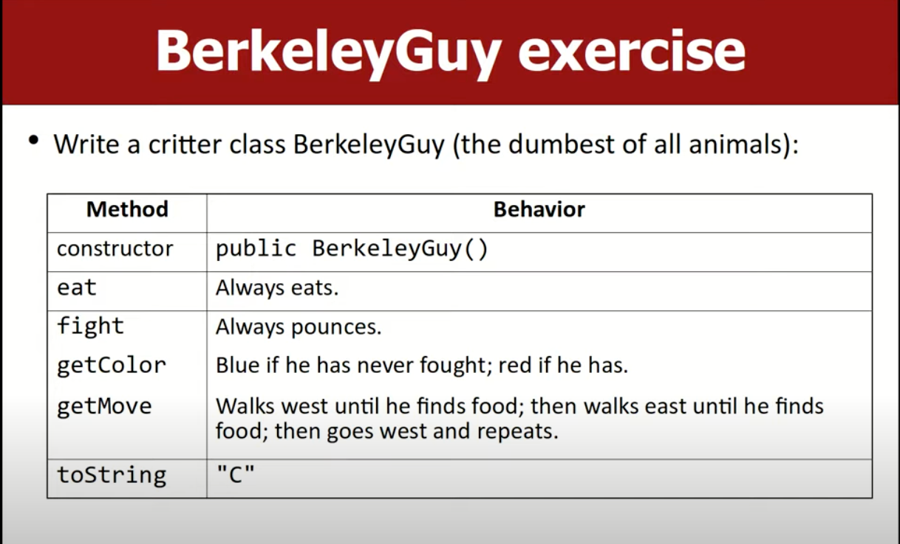
    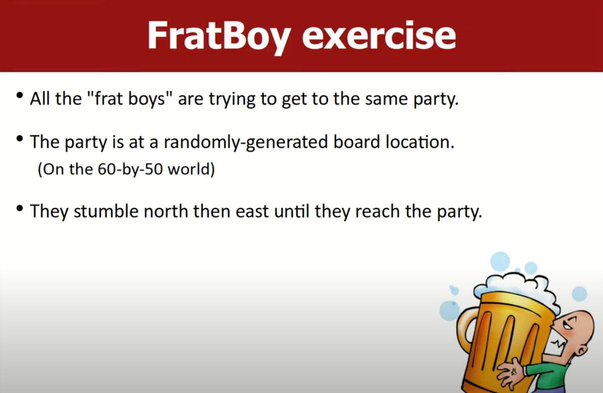
    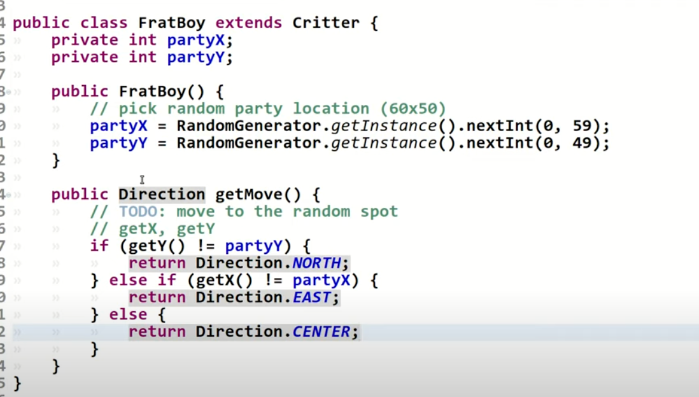

# Interface:

-   list of methods that a class can promise to implement (is-a relationship and code sharing)
    -   eg: Lawyer is an employee (optionally share code - don't inherits)
    -   method less interface can store shared constants

# Model and view

-   Model: data, business logic (store, load, save, search through data)
-   View: user interface (display the model - read user input, display data, handle events)
-   model:
    -   view listens for user events
    -   user clicks/types info
    -   view asks model for data / tell to modify / update data
    -   model returns data to the view
    -   view displays the data to the user

# True Java:

-   main: true entry point for a java program
-   String[]: args are command line arguments - optional
-   standard java methods are static, unless part of class of objects
