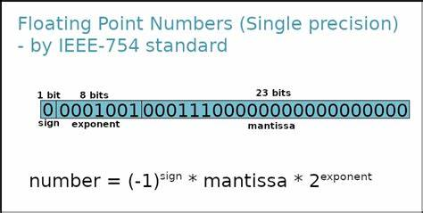
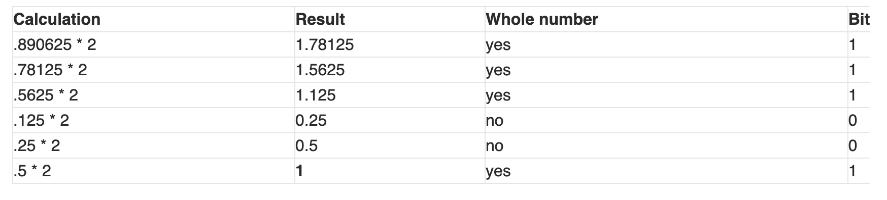
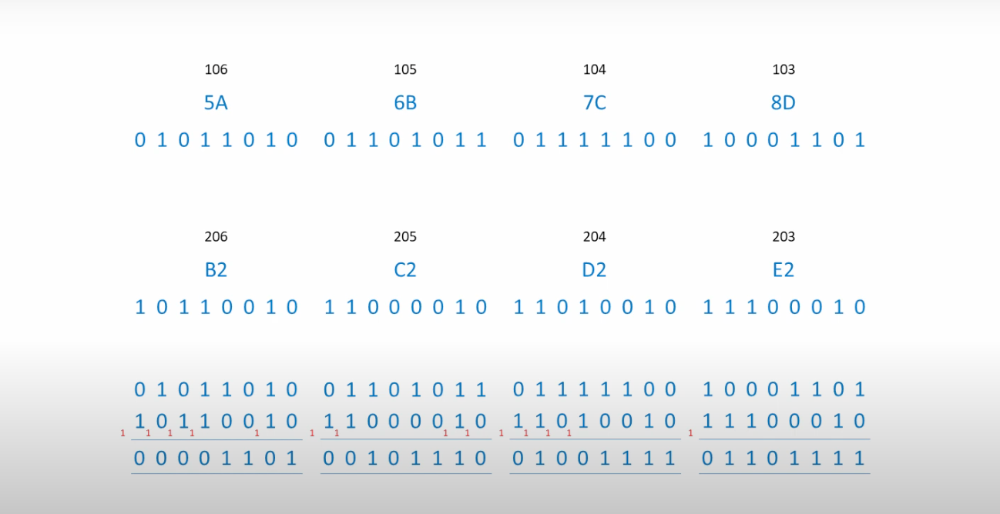
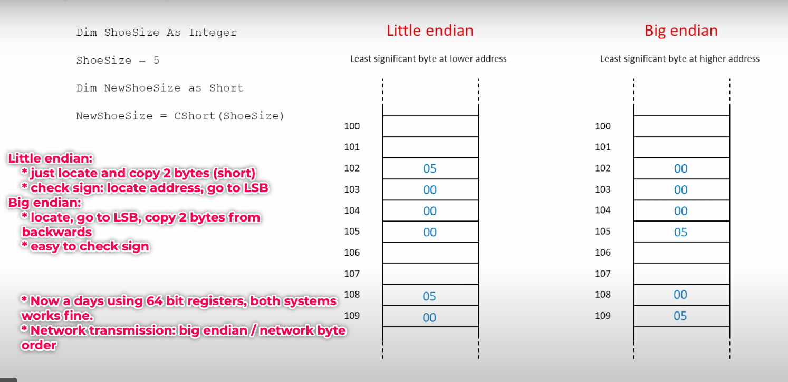
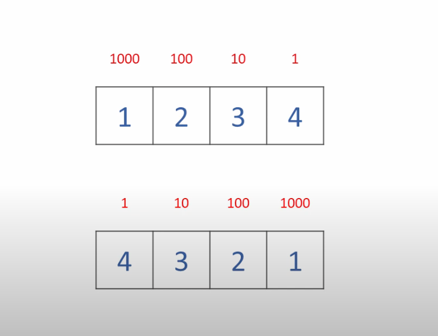
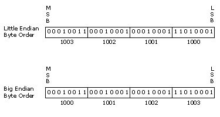
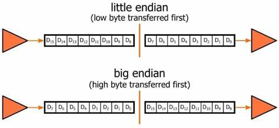
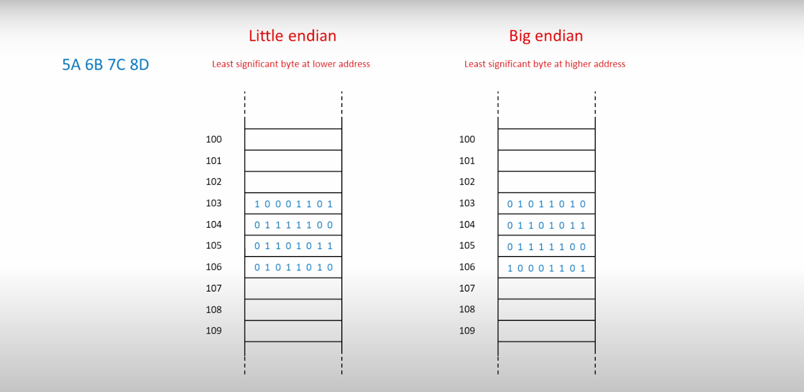
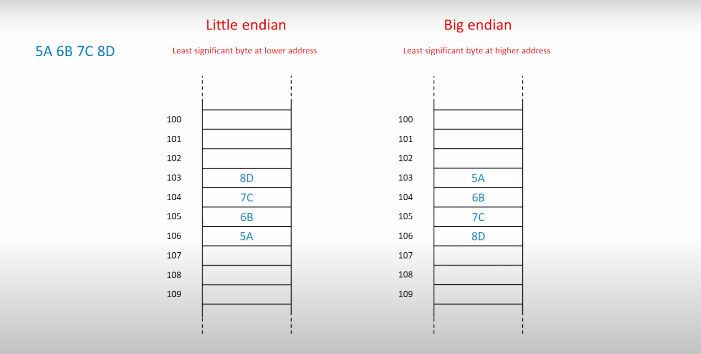
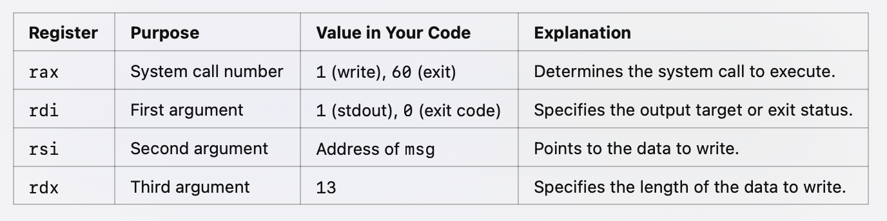

# Programming paradigms - CS 107
***

## References:
-   [CS107: Programming Paradigms](https://see.stanford.edu/Course/CS107)

## Important points
- **functions:**
  - strcpy: copies one char after other (not dynamically - no need to free)
  - strdup("Hello") -> stores the string in heap (string space) and returns address pointer
  - memcpy: takes source and destination pointers and copy the bytes (size given) from source to destination
  - memcmp(key, elemAddr, elemSize): compares two types, need to mention how many bytes
    - problems: 
      - different types: unexpected results (say int copied to long: no issues but int copied to float / double: different interpretation)
      - long to int: only 4 bytes copied (data loss)
  - memmove(dest*, source*, size): similar to memcpy, but handles overlapping memory
    - as memcpy doesn't handle overlapping it is efficient but memmove is not
  - free: frees the memory allocated by malloc
  - function prototype declaration
    - correct: int (*myFn)(void*, void*)
    - wrong: (int) (*myFn)(void*, void*) // no need to cast, mention return type
- **procedures:**
  - &array instead of array -> is preferred and safe
  - %s -> prints the string in the address (i/p: pointer of string - not the string itself)
  - void* -> address pointing to void
  - void** -> address of address pointing to void or address pointing to void *
  - dynamically allocated space need to be fred.
  - instead of swapping byte wise (two array: may different sized) -> try to swap pointers!
  - char*, char**, char*** : all are pointers of 4bytes
- **Habits:**
  - if a function allocates something, make itself free the memory allocated

## Lecture 1: Introduction:
-   C: procedural language, concurrent programming: run two/more functions simultaneously (networking)
-   MIPS: assembly language
-   Python: object-oriented language, high-level language, interpreted language. Pearl : OOP
-   Java: object-oriented language, platform-independent language
-   Lisp, scheme: representation of functional programming paradigm
    -   1 seat - can't allocate to many people: concurrent programming
    -   rely on the return value of a function to move forward
    -   no side effects, pass by reference
    -   scheme: no side effects, make potential result (smaller results -> larger partial result -> final result)

## Lecture 2: Data types
-   **C/C++ data types**
    -   bool (1 byte), char (1 byte)
    -   scalar: short (2 bytes), int (4 bytes), long (8 bytes)
        -   short: 2$^{16 - 1} - 1$ possibilities (MSB: sign bit)
    -   arbitrarily precise number: float (4 bytes), double (8 bytes)
-   **characteristics:**
    -   overflow: only consider 16 bits, 17th bit dropped
    -   all negative number has MSB bit = 1
    -   all positive number has MSB bit = 0
-   **implicit casting:**
    -   low bit data type copied into high bit data types: no loss
    -   char assigned to short (implicit casting) -> 65 (ASCII)
    -   short to char (loss) -> only copies left most 1st Byte alone, further byte dropped
-   **sign expand:**
    -   smaller byte type (short) to larger byte type (int)
    -   8 bit representation of -10 is 11110110 (00001001 (1's complement) + 1 = 00001010)
    -   32 bit representation is 11111111 11111111 11111111 11110110
    -   **why:**
        -   **Preserving Signed Values, Arithmetic Consistency, Type Promotion in Expressions**
        -   Sign extension occurs automatically when converting smaller signed types (e.g., char or short) to larger signed types (e.g., int or long).
	    -   For unsigned integers, zero extension (filling with 0s) occurs instead.
	    -   To explicitly control sign extension, you can use bitwise operations. For example:
        ```
            signed char small_num = -10; // 8-bit signed number
            int extended_num;
            extended_num = (int)small_num; // Automatic (standard)
        
            // manual (using bitwise operation)
            int manual_sign_extend = (small_num & 0xFF) | ((small_num & 0x80) ? 0xFFFFFF00 : 0);
        ```
-   **Float:**
    -   Integer with decimal points - 4bytes
    -   with limited memory - infinite precision is not possible
    -   1 bit to store the sign, 8 bits to store the decimal point, 23 bits to store the before decimal point value
    

- [Base 10 to binary (float: 34.890625):](https://blog.penjee.com/binary-numbers-floating-point-conversion/)
  - **Step: 1: Integral part to binary:**
    - 34 -> 0100010
  - **Step: 2: floating point:**
    - 0.890625 = 111001
    
  - **Step 3:**
    - 34.890625 = 100010.111001 * 2$^0$ -> 1.00010111001 * 2$^5$ (normalize) -> exponent: 127 + 5 = 132
  - **IEEE form:**
    - sign: 0
    - mantissa: 00010111001
    - exponent: 10000100 (132)
    - final form: 0 10000100 0001011100100000000000

- **binary to decimal (0 10000100 0001011100100000000000):**
  - sign: 0 (+ve)
  - exponent: 10000100 (132) -> 2$^{132}$ -> x + 127 = 132 -> x = 5
  - mantissa: 0001011100100000000000
  - (-1$^0$) * (1.00010111001) * 2$^5$ = 1.00010111001 * 2$^5$
  - 100010.111001 = 34.890625

-   **Making the language read an integer as float:**
    -   5.0 = 1.25 * 2$^2$
    ```
        int a = 5;
        float b = a; // 5.000000
    
        int c = 37;
        float d = *((float *) &i) -> consider address of i (int pointer as float pointer, then dereference as per IEEE standard)
    
        ans: result will be a very small number (0: our case)
        int representation: 00000000 00000000 00000000 00100101
        float interpretation: [Sign (1 bit)] [Exponent (8 bits)] [Mantissa (23 bits)]
        float:
            * sign: 0 (positive)
            * exponent: 00000000 
                *   x (power of 2) + 127 = y (IEEE exponent)
                *   x + 127 = 0 -> x = -127
            * mantissa: 0000000 00000000 00100101
            * calculation: 1.0000000 * 2^(-127) = 0
    ```
    ```
        float f = 7.0;
        short s = *((short *)&f);
        float representation:
            binary representation: 111.000 = 1.11 * 2^2
            sign: 0
            exponent: 2 + 127 = 129 -> 10000001 
            mantissa: 11000000000000000000000
        IEEE float representation: 0 10000001 11000000000000000000000
            01000000 11100000 00000000 00000000
        interpret as short (2 bytes):
            little endian: 
                rep: 01000000 11100000 00000000 00000000
                2 bytes: 00000000 00000000 = 0
            big endian: 
                rep: 00000000 00000000 11100000 01000000 
                2 bytes: 01000000 11100000 = big number
    ```


## Lecture 3: Endian
-   ```
    double d = 45;
    char ch = *((char *) &d);
    printf("%d %d", d, ch); -> 0 0 (reason: printing double as int)
    printf("%f %d", d, ch); -> 45.000000 0
    printf("%d %d", (int)d, ch); -> 45 0 (%c: will print .)
-   ```
    short s = 45;
    double d = *((double *) &s);
    printf("%d %f", s, d);
    
    reason:
        * takes 2 bytes from s, remaining six bytes try to read from residue (near by) -> may cause memory crash

-   **Big endian vs Little endian:**
    -   byte ordering (address: each indices)
    -   hex: 4 bits: 100 101 102 103 (2 bytes)
    -   little endian: LSB to MSN, big endian: MSB to LSB
        -   most machines: stick to one mode
        -   some machines like MIPS - can switch b/w modes
        | -   | Address | Little Endian | Big Endian |
        | --- | ------- | ------------- |
        | 100 | 78      | 12            |
        | 101 | 56      | 34            |
        | 102 | 34      | 56            |
        | 103 | 12      | 78            |
    -   Why two systems:
        -   Earlier IBM machines: big endian (mainframe, micro computers, early apple macs)
        -   intel used little endian (as efficient)
            -   add large numbers (carry forward - easy)
            
            
    -   Application:
        -   big endian: network transmission, JPEG, PNG, MPEG-4
        -   little endian: linux, GIF, BMP
        -   either big/little endian: TIFF
    -   Advantages:
        -   big endian:
            -   easy to determine sign
            -   compare two numbers (start from highest bit), divide, print (natural order)
        -   little endian: (linux, intel chips)
            -   multiplication and addition of multi precision numbers
                -   multiplication done from lower ten (little endian makes it easy)
                
                
                
                
                

-   **Struct memory usage:**
    -   In C: can access memory (using pi(base address) - can access d.denominator, other memory also)
    -   ```
        struct fraction{
            int numerator;
            int denominator;
        }
        // takes 8 bytes or more (stacked)
        struct fraction pi;
        // pi.numerator -> bottom of the stack, next pi.denominator
    
    | Value | Field          |
    |-------|----------------|
    | 7     | pi.denominator |
    | 22    | pi.numerator   |

-   **Access by reference:**
    -   int array[10] -> array[1] = ((int *) &array + 1) -> no need to explicitly cast to (int *)
    -   C/C++ doesn't bound check (good GDP compiler will show warning / error)
    -   ```
        *array = array[0]
        *(array + 1) = array[1]
        *(array + k) = array[k]
        // since int base -> 1 means adding 4 bytes to the address
        
        colleen\0 -> String is stores like this in memory (binary)
            *   chrArray points to c
            *   %s, chrArray + 1 will print olleen\0
    
## Lecture 4: Generic pointers
-   **Generic swap**
    -   ```
        void swap(void* a, void* b)
        {
            void temp = *a; // wrong: can't dereference (need info type), cannot allowed to have a variable of type void
            // void* : 4bytes pointer pointing to void
        }
    -   ```
        void swap(void* a, void* b, int byteSize)
        {
            char buffer [byteSize];
            memcpy(buffer, a, byteSize);
            memcpy(a, b, byteSize);
            memcpy(b, buffer, byteSize);
        }
        // we are swapping 4 bytes (pointer)
-   **integer linear search:**
    -   ```
        int linearSearch(int key, int array[], int size)
        {
            for(int i = 0; i < size; i++)
            {
                if(array[i] == key)
                {
                    return i;
                }
            }
            return -1;
        }
-   **Generic linear search:**
    -   need a separate comparing function
    -   ```
        void* linearSearch(void* key, void *arrayBasePtr, int arraySize, int elemSize)
        {
            for(int i = 0; i < arraySize; i++)
            {
                void* elemAddr = (char*) base + i * elemSize; // char* to handle byte by byte, since int* will assume +1 means 4 bytes
                if(memcmp(key, elemAddr, elemSize) == 0)
                {
                    return elemAddr;
                }
            }
            return NULL;
        }
        // compare using memcmp -> return pointer if matched
    -   ```
        void* linearSearch(void* key, void* array, int arraySize, int elemSize, (int) (*cmpFunction) (void*, void*))
        // takes function reference taking 2 void* as arguments and return int
        
        intCmp(void* ptr1, void* ptr2); // example function

## Lecture 5: More generic functions
-   **linear search with custom compare function:**
    -   ```
        void * lsearch(void* key, void* array, int elemCount, int (* cmpFn(void*, void*)))
        {
            for(int i = 0; i < elemCount; i++)
            {
                void* elemAddr = (char*) array + i * elemSize;
                if(cmpFn(key, elemAddr) == 0)
                {
                    return elemAddr;
                }
            }
            return NULL;
        }
        // function must match the prototype exactly
            return int, accept two void*
    -   ```
        int cmpFn(void* ptr1, void* ptr2)
        {
            return (*ptr1 - *ptr2);
        }
        // 0: match, less than 0: less, greater than 0: greater
-   **linear search: array of c strings:**
    -   char** : each element of the array holds address to the base of the string.
    -   array: 2 hops (1 hop: get string address, 2 hops: dereference and read the string(character wise))
    -   ```
        char* notes[] = {"Ab", "F#", "B", "Gb", "D"}; //in normal stack, not in heap memory - no need to free
        char* key = "Eb";
        char* found = lsearch(&key, notes, 5, sizeof(char*), strcmp);
        
        // note: length of each string, may be different
        
        cmpFn(*array, key) // *array means dereferencing char**
        
        int myStrcmp(void* ptr1, void* ptr2) // input is array: void* or void**: means nothing, just a pointer!
        {
            char * s1 = *(char**) ptr1;
            char * s2 = *(char**) ptr2;
            return (strcmp(s1, s2));
        }
    -   ```
        char* key = "A";
        char* key1 = "A";
        printf("%d", myStrcmp(&key, &key1));
        
        *   key -> has the address of "A", &A: passing the address of key
            *   dereference &key -> gives value of key(address to "A"), further dereferencing gives "A";
        *   passing myStrCmp(key, key1) -> segmentation error
            *   dereference key: get "A", further trying to dereference: error!
        
        char* key1; // uninitialized, need to assign an address (char*)

-   **Linear search in array of strings:**
    -   myStrCmp: 
        -   dereference the given indices of array: get pointer to Strings: then compare char*
    -   ```
        int s1[] = {1,2,3,4,5};
        int s2 = -1;
        printf("%d", strcmp((char*)s1, (char*)&s2));
        
        //differences
        *(char**) : dereference -> char*
            -   I opened outer case and giving inner suitcase which has the address to the string
        (char*) : no actual work done(just casting) - technically not accurate
            -   I pretend like giving inner but actually giving the outer suitcase (but C knows suitcase, doesn't know outer/inner)

-   **Binary search:**
    -   void* bsearch(void* key, void* array, int n, int elemSize, (int)(*cmpFn)(void*, void*));
    -   ```
        Algorithm:
            when(start == end): stop
            middle > key: bsearch(start, end = middle)
            middle < key: bsearch(start = middle + 1, end = end)
        
        // start, end, middle: are addresses not values
        void start = (void*) array;
        void end = (void*) (array + (n - 1) * elemSize);
        while(start <= end)
        {
            void* middle = (void*) (((long) start + (long) end)) / 2;
        }
        
        wrong: pointers are 4 bytes, long: 8 bytes -> core dumped when dereferenced.
    -   ```
        generic way: char*
        
        void* bsearch(void* array, int size, int elemSize, void* key, int (*cmpFn)(void*, void*))
        {
            int start = 0, end = size - 1;
            while(start <= end)
            {
                int middle = (end + start) / 2;
                int compResult = cmpFn(((char*) array + middle * elemSize), key);
                if(i == 0)
                {
                    return (void*) ((char*) array + middle * elemSize);
                }
                else if(compResult < 0)
                {
                    start = middle + 1;
                }
                else if(compResult > 0)
                {
                    end = middle;
                }
            }
            return NULL;
        }

## Lecture 6: stack implementation using struct

-   **int specific stack:**
    -   behavior: .h, .cc scheme (c++), no const, class, public/private (generic C)
    -   generic: always use void*, manually compute index(not like array[0]), same hops
    -   ```
        typedef struct{ // 4+4+4 = 12 bytes
            int *elements;
            int logicalLength;
            int allocationLength;
        }stack;
        
        void stackNew(stack* s);
            -   dynamically allocate using alloc function
        void stackDispose(stack* s);
        void stackPush(stack* s, int value);
        void stackPop(stack *s);
        
        inbuilt: void *realloc(void* ptr1, size_t, size)
    -   ```c
        void stackNew(stack* s)
        {
            assert (s != NULL);
            s.elements = (int*)malloc(4 * size(int)); // 16 bytes blob in heap dynamically allocated
            s.logicalLength = 0;
            s.allocationLength = 4;
        }
        // either it should return or directly store the newly created stack in the memory of the variable, for that we need address of stack.
        // send s (stack): means -> address of elements (1st variable), send &s: stack*
        
        //before running operations use s.elements != NULL: assert -> precaution/debugging will be easy
        
        void stackDispose(stack* s)
        {
            free(s.elements);
            // s: not allocated dynamically, no need to clear it, (dynamic string, malloc, calloc)
        } 
        
        void stackPush(stack* s, int value)
        {
            if(s.logicalLength == s.allocationLength)
            {
                s.allocationLength *= 2;
                s.elements = (int*)realloc(s.elements, 4 * sizeof(int)); // realloc called every 2^n times
            }
            s.elements[s.logicalLength] = value;
            s.logicalLength++;
        }
        // c++ has no realloc equivalent
        // realloc: if memory available, extend : else copy the entire memory to another free space and extend
        Realloc fails:
            •   time consuming as copies(search for free space, sequential)
            •   ignores shrink requests, only acts when more space required
            •   Returns NULL.
	        •	Leaves the original memory block unchanged.
	        •	It is the programmer’s responsibility to handle the NULL return value and avoid losing the reference to the original memory block.
        
        int stackPop(stack* s)
        {
            assert(s.elements != NULL);
            s.logLength--;
            return s.elements[s.logicalLength - 1];
        }
        
        void stackNew(stack* s);
        
        stack s;
        stackNew(&s); // send address, so that store directly (as struct stored in memory: by value not by reference!)

-   **Generic stack:**
    -   ```c
        typedef struct{ 
            void *elements;
            int elemSize; //can't assume as int, need data type size
            int logicalLength;
            int allocationLength;
        }stack;
        
        void stackNew(stack* s, int elemSize);
        void stackDispose(stack* s);
        void stackPush(stack* s, void* value);
        void* stackPop(stack* s, void* elemAddr); //return any address: int, ...
            *   supply previous element address, easy to remove
        
        void stackNew(stack* s, int elemSize)
        {
            assert(elemSize > 0);
            s->elemSize = elemSize;
            s->logicalLength = 0;
            s->allocationLength = 4;
            s->elements = malloc(4*elemSize);
            assert(s->elements != NULL);
        }
        //initially: 4, 4, 4, 4: 16 bytes, elements: points to 16 bytes block
        
        void dispose(stack* s)
        {
            free(s->elements);
        }
        
        void stackPush(stack* s, void* elemAddress)
        {
            if(s->logicalLength == s->allocationLength)
            {
                stackGrow(s);
            }
            void* target = (char*)s->elements + (s->logicalLength * s->elemSize);
            memcpy(target, elemAddr, s->elemSize); // copying 4 bytes (say) from the memory location pointed to by elemAddr into the memory location pointed to by target.
            s->logicalLength++;
        }
        
        static void stackGrow(stack* s) //c++: static internally linked (linker can easily use instead of searching which one globally)
        {
            s->allocationLength *= 2;
            s->elements = realloc(s->elements, s->allocationLength * s->elemSize);
            assert(s->elements != NULL);
        }
        
        void stackPop(stack* s, void* elemAddr)
        {
            assert(s->logicalLength > 0);
            s->logicalLength--;
            void* source = (char*)s->elements + (s->logicalLength * s->elemSize);
            memcpy(elemAddr, source, s->elemSize);
        }// source-> element that should be popped, elemAddr -> address where the popped element should be stored
        
        /*
            elements = [1, 2, 3, 4, 5]; // logical length = 5, copy 5 to the elemAddr: input
            elem + 4 -> address of 5, store content in elem + 4 to elemAddress
            But personally i think: that instead of writing, just return! (I don't like the approach, give your suitcase, I will fill it)
            too much of pointers, too much of changes (hard to manage)
            test cases:
                *   store and pop: 1 million times
        */
        
-   **can't do pointer arithmetic on void**:*
  - technique 1: convert to char* and add offset ((char*) array + 1)
  - technique 2: use (unsigned long) -> do normal arithmetic: plain math

#   Lecture 7: Strings and stacks
-   **stack having array of strings:**
  - ```c
    int main()
    {
        const char* letters[] = {"AI", "Bob", "Carl"};
        stack stringStack;
        stackNew(&stringStack, sizeof(char*));
        for(int i = 0; i < 3; i++)
        {
            char* copy = strdup(friends[i]);
            stackPush(&stringStack, &copy);
            // why separate copy: stackPush: only address, if we change the value of copy, it will change the value in the stack
        }
        // array of string: just copy the address to the array
        /*
            iteration 1: array[0] has address of "AI"
            iteration 2: array[1] has address of "Bob"
            iteration 3: array[2] has address of "Carl"
        */
    
        for(int i = 0; i < 3; i++)
        {
            char* copy;
            stackPop(&stringStack, &copy);
            printf("%s\n", copy);
            free(copy);
        }
        stackDispose(&stringStack);
    }
    
    // making more general: get dispose function from the user
    typedef struct{
        void* elements;
        int elemSize;
        int logicalLength;
        int allocationLength;
        void (*freeFunction)(void*); // don't use (void): not casting, declaring return type
    }stack;
    
    void stackNew(stack* s, int elemSize, void (*freeFunction)(void*))
    {
        s->elemSize = elemSize;
        s->logicalLength = 0;
        s->allocationLength = 4;
        s->elements = malloc(4 * elemSize);
        s->freeFunction = freeFunction;
    }
    
    void stackDispose(stack* s)
    {
        if(s->freeFunction != NULL)
        {
            for(int i = 0; i < s->logicalLength; i++)
            {
                s->freeFunction((char*)s->elements + i * s->elemSize);
            }
        }
        free(s->elements);
        // why loop: each string allocated using strdup -> individually free!
    }
    
    void stringFree(void* elem)
    {
        free(*(char**) elem);
    }
    // why *(char**): 
        *   i/p: address of array, dereference: get the address of the string
        *   hence: variable/array element holding address of char* -> char** 
    // free while pop:
        *   i'm returning address to the popped string, if i release and donate the space of the string to heap
        *   no use in returning the address of the popped string
    // when to free:
        *   when the stack is disposed, free the memory allocated by strdup
    
    why giving &stringStack instead of stringStack to stackDispose:
        *   stackDispose: free the memory allocated by stackNew
        *   stackNew: dynamically allocated memory (stack: not dynamically allocated)
        *   stackDispose: free the memory allocated by stackNew
    what happens if i pass struct instead of memory of struct: (always pass pointer to struct)
        *   if struct is passed, the function gets the copy of entire struct instead of just address
        *   if struct is passed, the changes made in the function will not reflect in the main function
        *   if address is passed, the changes made in the function will reflect in the main function
    ```
- **Rotate an array:**
  - ```c
    // Circular rotation:
    void rotate(void* front, void* middle, void* end);
    
    shift an array:
        *   copy 4 to n-1 to 0 to (n-1) - 4 : memcpy
        *   potential problem: overlapping memory: undefined behavior
        *   overlapping problem:
            *   memcpy: copy from source to destination
            *   if source and destination overlap: undefined behavior
            *   example: 0 to 4 to 2 to 6
                *   A B C D E null null -> A B A B C D E (expected)
                *   A B C D E null null -> A B A B A B A (actual: before copying, overwrite the destination)
        *   solution:
            *   copy from end to front
            *   copy from front to end
    
    void rotate(void* front, void* middle, void* end)
    {
        int frontSize = (char*)middle - (char*)front; //returns number of bytes b/w the two addresses
        int backSize = (char*)end - (char*)middle;
        char buffer[frontSize];
        memcpy(buffer, front, frontSize);
        memmove(front, middle, backSize); // dest, source, number of bytes
        memcpy((char*)end - frontSize, buffer, frontSize);
    }
    
    /*
        Rotate by 4:
            step1: array: A B C D E F G H (1001, 1002, 1003, 1004, 1005, 1006, 1007, 1008)
                * frontSize: 1005 - 1001 = 4 bytes
                * backSize: 1008 - 1005 = 3 bytes
                * buffer[3] -> A B C D
            step2: create buffer -> A B C D (4 bytes)
            step3: copy back to front -> E F G H E F G H
            step4: copy buffer to end -> E F G H A B C D
        logic: do pointer arithmetic and calculate number of bytes between them.
    */
    ```
- **Quick sort:**
  - fast sorting algorithm along with merge sort
  - ```c
    void quickSort(void* base, int size, int elemSize, int (*cmpFn) (void*, void*));
    ```
- **Memory:**
  - pointers: 4 bytes: 2$^{32}$ - 1
  - local variable: drawn from stack (subset of RAM): most recently called
  - heap: managed by software: malloc, calloc, realloc, free (heap manager/memory allocator)
  - stack: managed by hardware: push, pop, call, return
  - **working of malloc, realloc, calloc:**
    - allocate numBytes -> heap(one large rectangle)
    - realloc: if space available - extend, no: search another, copy and return base address
    - memory allocator has free notes / free list: which memory is free, which is not

# Lecture 8: Heap and stack
- **Heap:**
  - managed by software included in the language library - everytime linked by the linker program (even not used)
  - malloc, calloc and realloc: managed by c software (lower and higher address of heap: advertised to the library function going to use)
  - when a pointer is given to free/realloc: it assumes that the pointer is previously handled by malloc/realloc : legitimate
  - sometimes memory allocated: more than we asked (usually 4/8 bytes extra, use the metadata: free the memory later)
- **free:**
  - say initially int* array = malloc(100 * sizeof(int)), now only 60 enough
    - free(array + 60): no meta data(assumes wrong byte as meta: may cause disaster)
      - why wrong:
        - always assumes: original pointer returned by malloc/realloc is given (metadata)
        - corrupted metadata: undefined behavior (c won't do error check for efficiency: assumes wrong byte as metadata)
          - say in the wrong byte: 25000 -> 25000 bytes freed from the memory
        - ```c
          int* array = malloc(100 * sizeof(int)); // Allocate memory
          int* subArray = array + 60;            // Work with part of the array
          // Do your work with subArray...
          free(array); // Always free the original pointer
          ```
          
- **static vs dynamic allocation:**
  - int array[100]; -> static in stack (no need to free), c doesn't error check (doesn't ensure array is in heap, randomly does something)
  - dynamic: allocated by malloc, calloc and realloc
- **free list:**
  - collection of free memory for future use
  - free just overwrites metadata: not removes data from the memory! (costly)
  - implementations:
    - 1: keep track of all void* (hand over memory), any error: ignore (but later causes problem)
    - 2: always give out multiples of 8 bytes / 64 bytes of memory (160 bytes: allocates 192/256 bytes)
      - sometimes accessing array[11] -> where size is 10, may not cause error: due to this!
      - issue: array[-1] -> if allowed to modify, modify metadata: huge problem (must not allow to override metadata bytes)
    - 3: not common: best fit (entire heap aggressive search): allocate only enough minimum space
      - best fit types: choose so big blocks, even after usage can be used by others (4/8 bytes won't be needed by others, so leave big for others)
  - advantages:
    - quickly read metadata: hop to next metadata -> skip that many bytes instead of hopping all of them
    - if metadata has pointer to next unused heap: can easily traverse and allocate memory
    - like free blocks connected as linked lists, traverse (enough space: allocate), no: continue traversal
- **Heap structure:**
  - address of entire free list, first four bytes: NULL (size of heap)
  - for 40 bytes: 40 bytes block: best fit, 80 bytes block: worst fit
  - realloc: compacting the memory: try to allocate the new memory as close as the previous one
  - not predictable (may or may not possible)
- **Handles:**
  - OS uses handles (pointers two hops away): list of single pointers - free memory
  - advantage: owned by heap manager, can update without writing / affecting the void** (actual memory)
  - disadvantage: two hops away: slow, extra memory (extra 4 bytes)
  - macintosh (1994-95): used this
  - problems:
    - compacted in low priority thread (no space: can't actually have heap compaction going on simultaneously while actually dereferencing it)
    - get memory: aggressively managed
    - ```c
        void** handle = new Handle(40);
        //cannot read while moving, handleLock(handle), handleUnLock(handle)
        while reading(dereferencing): lock the handle)
      ```
      
- **Activation stack or stack frame:**
  - stack: function calls, local variables, return addresses
    - has track of records, decremental
  - ```c
    void A()
    {
        int x = 10; // disabled (stack)
        short b[4]; // disabled (stack)
        double c; // disabled (stack)
        B(); // activated, disabled
        C(); // activated, disabled
    }
    
    void B()
    {
        int y = 20; // disabled (stack)
        short d[4]; // disabled (stack)
        double e; // disabled (stack)
        C();
    }
    
    void C()
    {
        int z = 30; // disabled (stack)
        short f[4]; // disabled (stack)
        double g; // disabled (stack)
    }
    
    working:
        * pointer to layer/frame: points to most recently called function's activation record
        * when A is called:
            1) create frame for A, A.B, A.C
            2) destroy A.C frame, return to A.B frame
            3) destroy A.B frame, return to A
            4) create A.C frame, destroy A.C frame, return to A frame
        * each frame has own variables (local), when frame gone: they are also gone
        * B doesn't know C is called and cannot access C's local variables
    ```
- **Computer processor: registers**
  - Register: general purpose (4 byte figure), registers are in touch with RAM
  - does ALU (+, -, &&, mod, /, //, %, &, |, ^, ~, <<, >>)
  - ALU: in touch with registers not directly with RAM
  - working:
    - take something from memory, load in registers, do operation, store back in memory
    - RAM is expensive / slow (load, process, store by registers: uses flash: cost-effective and speed effective)
  - **Why registers** (trade off b/w speed and complexity (greater clock speed, faster execution))
    - faster access than RAM (part of CPU), CPU uses registers for temporary storage, decode, execute, write back and control instructions
        -   Accumulator Registers: Store results of arithmetic and logical operations.
        -   Program Counter (PC): Keeps track of the address of the next instruction to execute. 
        -   Instruction Register (IR): Holds the instruction currently being executed.
  - **Difference Between RAM and Registers**
    
    | **Aspect**       | **Registers**                                             | **RAM**                                               |
    |-------------------|----------------------------------------------------------|-------------------------------------------------------|
    | **Purpose**       | Temporary storage for data being processed by the CPU.   | General-purpose storage for programs and data.        |
    | **Role**          | Holds data immediately needed by the CPU, such as operands and intermediate results. | Stores program instructions, variables, and data for the CPU to access as needed. |
    | **Speed**         | Extremely fast, as they are part of the CPU itself.      | Slower compared to registers but faster than storage devices (like SSDs). |
    | **Access Time**   | A few nanoseconds or less (typically single-cycle access).| Higher latency, measured in tens of nanoseconds.      |
    | **Size**          | Very small (a few bytes to kilobytes).                   | Much larger (megabytes to terabytes in modern systems).|
    | **Storage**       | Limited to storing specific data like integers, floating-point numbers, or memory addresses. | Can store large amounts of data, including entire programs. |


# Lecture 9: Assembly code
- **Assembly code:**
  - low-level programming language: human-readable form of machine code
  - each assembly language is specific to a particular computer architecture
  - example:
  - ```c
    int main()
    {
          int x = 10;
          int y = 20;
          int z = x + y;
          return z;
    }
    
    assembly code: (r1,..rn: general purpose registers)
    main:
        mov r1, 10;
        mov r2, 20;
        add r3, r1, r2;
        mov r0, r3;
        ret;
    ```
  - **Advantages:**
    - faster execution: direct interaction with hardware
    - memory efficient: no overhead of high-level language
    - **behavior:**
      - reuse registers, overwriting allowed, os itself optimized to deal with 4 byte figures
      - int, pointer: most commonly used atomic types
      - cannot load and store at the same time
    - **Disadvantages:**
      - difficult to write and maintain (simple operation: more than 3 lines, must be sequential)
      - not portable: specific to a particular architecture
  - **Assembly code structure:**
    - **Data section:** .data: variables, constants, strings
    - **Text section:** .text: instructions, functions
    - **BSS section:** .bss: uninitialized data
  - **Registers:**
    - **General-purpose registers:**
      - EAX, EBX, ECX, EDX: 32-bit
      - RAX, RBX, RCX, RDX: 64-bit
    - **Segment registers:**
      - CS, DS, SS, ES, FS, GS
    - **Index registers:**
      - ESI, EDI
    - **Pointer registers:**
      - EIP, ESP, EBP
    - **Control registers:**
      - EFLAGS
    - **Instruction pointer:**
      - EIP: points to the next instruction

- **Assembly Instructions:**
  - **mov:** move data from source to destination
    - ```assembly
      mov eax, 10; // move 10 to eax
      mov ebx, eax; // move eax to ebx
      ```
    - **add:** add two operands
    - **sub:** subtract two operands
    - **mul:** multiply two operands
    - **div:** divide two operands
    - **inc:** increment operand by 1
    - **dec:** decrement operand by 1
    - **and:** bitwise AND operation
    - **or:** bitwise OR operation
    - **xor:** bitwise XOR operation
    - **not:** bitwise NOT operation
    - **shl:** shift left
    - **shr:** shift right
    - **push:** push data onto the stack
    - **pop:** pop data from the stack
    - **call:** call a procedure
    - **ret:** return from a procedure
    - **jmp:** jump to a specified address
    - **cmp:** compare two operands
    - **jz:** jump if zero
    - **jnz:** jump if not zero
    - **je:** jump if equal
    - **jne:** jump if not equal
    - **jl:** jump if less than
    - **jle:** jump if less than or equal
    - **jg:** jump if greater than
    - **jge:** jump if greater than or equal
    - **lea:** load effective address
    - **nop:** no operation
    - **int:** interrupt
    - **hlt:** halt the processor
    - **loop:** loop until counter is zero
    - **rep:** repeat the next instruction
    - **movsx:** move with sign extension
    - **movzx:** move with zero extension
    - **xchg:** exchange two operands
    - **bswap:** byte swap
    - **cdq:** convert double to quad
    - **cwd:** convert word to double
    - **div:** divide
    - **idiv:** signed divide
    - **imul:** signed multiply
    - **mul:** multiply
    - **beq:** branch if equal
    - **bne:** branch if not equal
    - **bge:** branch if greater than or equal
    - **ble:** branch if less than or equal
    - **bne:** branch if less than or equal
    - **bgt:** branch if greater than
- **sample code:**
  - ```c
    int array[4];
    for (int i = 0; i < 4; i++)
    {
        array[i] = 0;
    }
    i--;
    
    assembly:
    .data
    array dd 4 dup(0) // allocate array of 4 integers, initialize to 0
    .text
    mov ecx, 0 // initialize loop counter
    mov eax, 0 // 0 value to assign to all elements of the array
    mov ebx, 4 // set loop limit
    L1:
        mov [array + ecx * 4], eax
        inc ecx
        cmp ecx, ebx
        jl L1
    
    note: assembly instruction vary from one architecture to another, normally each statement is 4 bytes: use jmp pc + 40 (10 statements), or use some tag, jmp to tag
        *   assembly code: sub divided into sub packets
        * M[R2 + 4] -> offset by 16 bytes, get value
    ```
    
- **pointers and casting:**
  - ```c
    ((struct fraction*)&pi)->dnum; // &pi: base address of struct
    // casting: (struct fraction*) -> cast to struct fraction pointer
        // assembly has no casting, just move data from one register to another
        // just compiler things!
    ```
    

# Lecture 10: Assembly code and pointers, stacks
- The stack has parameters copy, info on function which called it, local parameters
- SP: stack pointer (truly points to the lowest address of the stack)
- BP: base pointer (points to the base of the current stack frame)
```
    *   Stack frame (first in last out): function prologue and epilogue
        *   Function prologue: set of instructions executed while calling a function
            *   push ebp: saves the base pointer of the previous stack frame (restore while quitting the function)
            *   mov ebp, esp: set the base pointer to the current stack pointer
            *   sub esp, n: allocate space for local variables
        *   Function epilogue: set of instructions executed at the end of a function to clean up the stack and restore the state of the program before returning control to the caller
            *   mov esp, ebp: restore the stack pointer
            *   pop ebp: restore the base pointer
            *   ret: return from the function
        *   stack frame has local variables(access using ebp), parameters (access using ebp), return address (access using ebp), base pointer (saved and restored by prelogue and epilogue functions), stack pointer (point to top of the stack, used to allocate or deallocate space on the stack)
        *   Stack frame layout:**
                Higher memory addresses:
                    local variables
                    parameters
                    return address
                    base pointer
                    stack pointer
                Lower memory addresses:
```
```c
int add(int a, int b) 
{
    int sum = a + b;  // Local variable
    return sum;       // Return value
}

int main() 
{
    int result = add(5, 3); // Function call
    return result;
}

note: mov ebp, eax means moving address that eax pointing to ebp
      mov eax, [ebp - 4] means moving value at ebp - 4 to eax

step1: Function prologue: (stack layout: higher address to lower addresses)
    * functions of ESP, EBP:
        *   ESP: track top of the stack: allocate and deallocate space for local variables
        *   EBP: tracks the base of the current stack frame (reference point for accessing local and function parameters)
        *   caller of a function doesn't know about local variables of the calling method / implementations
    *   call add(5,3);
        *   push arguments (5, 3) onto the stack
        *   push return address (where to resume after function ends)
        *   push previous base pointer to the stack
        *   allocate space for local variables
                      Higher Memory Addresses   access via BPB |
                    |-------------------------|----------------|
        ESP ->      | Local Variables         |   EBP - 4      | <- Allocated in the prologue (ESP changes). 
        EBP ->      | Saved Base Pointer      |   EBP          | <- Previous function's `EBP`. (when ESP is pointing at this point, ESP is copied to EBP)               
                    | Return Address          |   EBP + 4      | <- Where to return after the function.
                    | Function Parameters     |   EBP + 8      | <- Passed arguments.
                    |-------------------------|----------------|
                    | Lower Memory Addresses  |                |
    *   inside the function:
        *   a = [EBP + 12]
        *   b = [EBP + 8]
        *   sum = [EBP - 4]
        *   store the return value in EAX (ensure return value persists, even after the stack is cleaned up): mov eax, [ebp - 4]
    *   function epilogue:
        *   deallocate space for local variables, now stack pointer points to the base pointer
        *   pop the base pointer
        *   jump to the return address on the stack, stack is cleaned up
        *   main resumes execution 
```


# Extended x86-64 Assembly Register and Instructions Cheatsheet

---

## General Purpose Registers
| Register | Description                                 |
|----------|---------------------------------------------|
| **RAX**  | Accumulator register for arithmetic and return values. |
| **RBX**  | Base register, preserved across calls.      |
| **RCX**  | Counter register for loops.                |
| **RDX**  | Data register for I/O and multiplication/division. |
| **RSI**  | Source index, often for memory operations. |
| **RDI**  | Destination index, often for memory operations. |
| **R8-R15** | General-purpose registers.               |

---

## Special Purpose Registers
| Register | Description                                 |
|----------|---------------------------------------------|
| **RIP**  | Instruction pointer, points to next instruction. |
| **RSP**  | Stack pointer, points to top of the stack. |
| **RBP**  | Base pointer, used for stack frames.       |
| **FLAGS**| Status register, contains flags for conditional operations. |

---

## Syscall Table (Linux)
Common syscall numbers:
| Syscall Number | Name         | Description                      |
|----------------|--------------|-----------------------------------|
| `1`            | `write`      | Write to a file descriptor.      |
| `60`           | `exit`       | Exit the program.                |
| `0`            | `read`       | Read from a file descriptor.     |
| `39`           | `getpid`     | Get process ID.                  |
| `56`           | `fork`       | Fork a process.                  |

### Syscall Parameter Mapping:
| Register | Purpose                        |
|----------|--------------------------------|
| **RAX**  | Syscall number                |
| **RDI**  | First argument                |
| **RSI**  | Second argument               |
| **RDX**  | Third argument                |
| **R10**  | Fourth argument               |
| **R8**   | Fifth argument                |
| **R9**   | Sixth argument                |

---

## Stack Operations
| Instruction | Description                              |
|-------------|------------------------------------------|
| `push rax`  | Pushes `rax` onto the stack.             |
| `pop rbx`   | Pops the top value from the stack into `rbx`. |
| `call func` | Calls `func` by pushing return address onto the stack. |
| `ret`       | Pops the return address and jumps back.  |

---

## Common Instructions
### Data Movement
| Instruction       | Description                              |
|--------------------|------------------------------------------|
| `mov rax, rbx`     | Copies the value in `rbx` into `rax`.   |
| `mov rax, [rbx]`   | Loads value at memory address in `rbx` into `rax`. |
| `mov [rbx], rax`   | Stores value of `rax` at memory address in `rbx`. |
| `lea rax, [rbx+4]` | Loads effective address into `rax`.     |

### Arithmetic
| Instruction       | Description                              |
|--------------------|------------------------------------------|
| `add rax, rbx`     | Adds `rbx` to `rax`.                    |
| `sub rax, rbx`     | Subtracts `rbx` from `rax`.             |
| `imul rax, rbx`    | Multiplies `rax` by `rbx`.              |
| `idiv rbx`         | Divides `rax` by `rbx` (remainder in `rdx`). |
| `inc rax`          | Increments `rax` by 1.                  |
| `dec rax`          | Decrements `rax` by 1.                  |

### Logic and Bitwise Operations
| Instruction       | Description                              |
|--------------------|------------------------------------------|
| `and rax, rbx`     | Performs bitwise AND between `rax` and `rbx`. |
| `or rax, rbx`      | Performs bitwise OR between `rax` and `rbx`.  |
| `xor rax, rbx`     | Performs bitwise XOR between `rax` and `rbx`. |
| `shl rax, 1`       | Shifts `rax` left by 1 (multiply by 2). |
| `shr rax, 1`       | Shifts `rax` right by 1 (divide by 2).  |

### Conditional and Branching
| Instruction       | Description                              |
|--------------------|------------------------------------------|
| `cmp rax, rbx`     | Compares `rax` with `rbx` (sets flags). |
| `je label`         | Jumps to `label` if equal (ZF=1).       |
| `jne label`        | Jumps to `label` if not equal (ZF=0).   |
| `jg label`         | Jumps to `label` if greater (SF=OF, ZF=0). |
| `jl label`         | Jumps to `label` if less (SF≠OF).       |
| `jmp label`        | Unconditional jump to `label`.          |

---

## String Operations
| Instruction       | Description                              |
|--------------------|------------------------------------------|
| `movsb`           | Move byte from `[rsi]` to `[rdi]`.      |
| `movsw`           | Move word (2 bytes) from `[rsi]` to `[rdi]`. |
| `rep movsb`       | Repeat `movsb` `rcx` times.             |
| `cmpsb`           | Compare byte at `[rsi]` and `[rdi]`.    |

---

## Debugging Instructions
| Instruction       | Description                              |
|--------------------|------------------------------------------|
| `int 3`           | Triggers a breakpoint for debugging.    |
| `nop`             | Does nothing; useful for padding or timing. |

---

| **Register** | **Purpose**                          | **Common Values**                          | **Example Usage**                                     |
|--------------|--------------------------------------|--------------------------------------------|------------------------------------------------------|
| **`rax`**    | Syscall number                      | `1` → `write` <br> `0` → `read` <br> `60` → `exit` | `mov rax, 1` → Specify `write` syscall              |
| **`rdi`**    | First argument                      | For `write`: <br> `1` → `stdout` <br> `2` → `stderr` <br> File descriptor (e.g., `3`, `4`, etc.) <br> For `exit`: <br> Exit code (`0` for success) | `mov rdi, 1` → Specify `stdout` as output target    |
| **`rsi`**    | Second argument                     | Memory address of data (e.g., buffer for `write`) | `lea rsi, [msg]` → Address of the message to write  |
| **`rdx`**    | Third argument                      | Length of data in bytes (e.g., for `write` or `read`) | `mov rdx, 13` → Write 13 bytes from buffer          |

---

### Example: Write to `stdout`
| **Instruction**     | **Action**                                  |
|----------------------|--------------------------------------------|
| `mov rax, 1`         | Specify the syscall (`write`)              |
| `mov rdi, 1`         | File descriptor: `stdout`                 |
| `lea rsi, [msg]`     | Address of the string to write             |
| `mov rdx, 13`        | Length of the string (`13` bytes)          |
| `syscall`            | Perform the syscall to output the message |

## Example: Simple Syscall Program
This program writes "Hello, World!" to the screen and exits:

```asm
section .data
    msg db "Hello, World!", 0xA  ; Message with newline
    len equ $ - msg              ; Calculate length

section .text
    global _start

_start:
    mov rax, 1                   ; syscall: write
    mov rdi, 1                   ; file descriptor: stdout
    lea rsi, [msg]               ; Address of the message
    mov rdx, len                 ; Length of the message
    syscall                      ; Make the syscall

    mov rax, 60                  ; syscall: exit
    xor rdi, rdi                 ; Exit code 0
    syscall                      ; Make the syscall
```
```assembly
    int fact(int n)
    {
        if(n == 0)
        {
            return 1;
        }
        return n * fact(n - 1);
    }
    
    x86-64 architecture:
    
    fact:
        cmp rdi, 0                ; if n == 0
        je .base_case             ; jump to base case if true
        push rdi                 ; save n on the stack
        dec rdi                   ; n = n - 1
        call fact                 ; recursive call to fact(n-1)
        pop rdi
        imul rax, rdi             ; multiply result by n
        ret                       ; return the result

    .base_case:
        mov rax, 1                ; base case: return 1
        ret
    
    note: use stack: recursive calls to preserve values (using registers like r8: not working, overridden by recursive calls)
```

# Lecture 11: swap function in assembly

