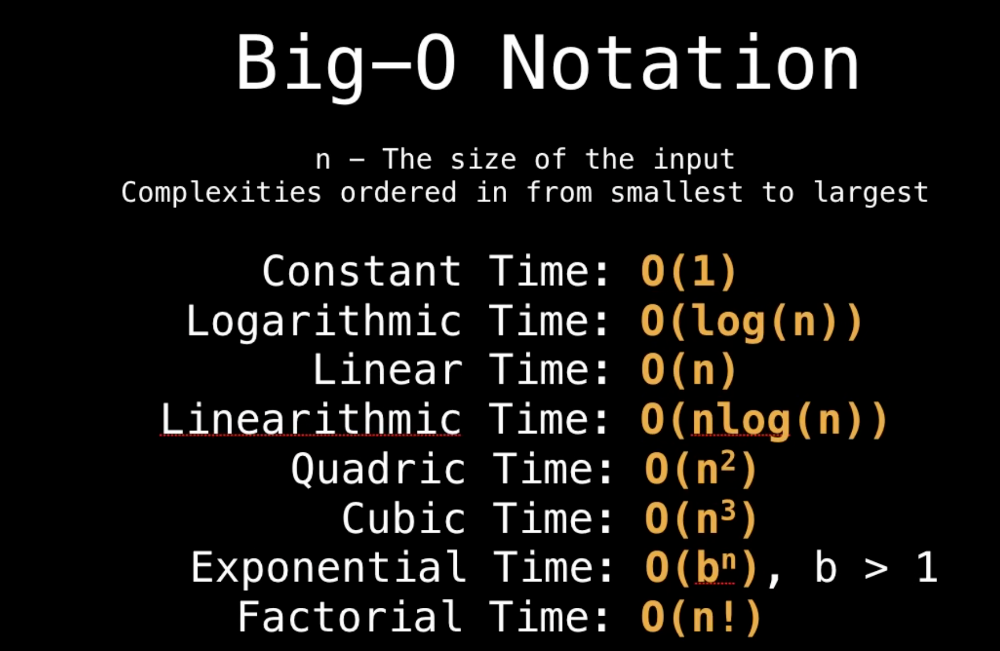
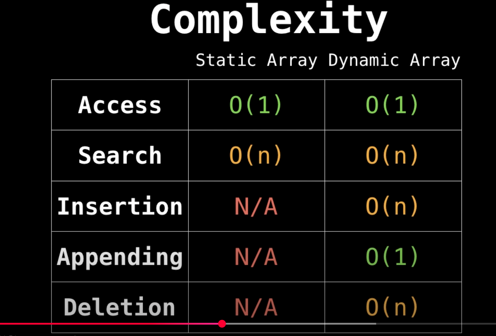

# Data Structures
***

## What is data structure:
-   Way of organizing data : use effectively (read, write, update, delete)
-   Essential ingredient in creating fast and powerful algorithms
-   Thing that differentiates a great product from an ordinary one
-   Manage and organize data (cleaner and understandable code)

## Abstract Data Structure VS Data Structure:
-   ADT: abstraction of a data structure (interface), no details on implementation
-   Defines how it should behave, methods it should have but not how implemented
-   list(dynamic array, linked list)
-   map (hash map / hash table, tree)
-   queue (array based, stack based, linked list based)
-   vehicle (gold cart, bicycle, smart car)

## Computational complexities
-   Time (Big O): upper bound of the complexity (worst case) as input size becomes arbitrarily large

-   **Big O properties**
    -   O(n + c) = O(n)
    -   O(c * n) = O(n), c > 0
    -   f(n) = 7log(n)$^3$ + 15n$^2$ + 2n$^3$ + 8 = O(n$^3$)
-   **Real world examples:**
    -   log(n) : binary search
    -   n : linear search
    -   O(2$^n$) : finding all subsets of a set
    -   O(n!) : finding all permutations of a string
    -   O(n log n) : sorting algorithms (merge sort, quick sort)
    -   O(m * n) : iterating over all the cells of a matrix

## Arrays (static and dynamic):
-   Fundamental data type, most commonly used
-   **Static array:**
    -   fixed length container with n elements (indexable: 0 to n-1 range)
    -   first element: 0th index
    -   indexable: slot/index -> reference with a number
    -   **when and where to use:**
        -   store and access sequential data
        -   temporarily store objects
        -   used by IO routines as buffers
        -   lookup tables and inverse lookup tables
        -   return multiple values from a function
        -   used in dynamic programming to cache answers to sub problems
    -   **complexity:**
        -   access in O(1)
        -   search: O(n)
        -   insert: fixed size
        -   append: fixed size
        -   delete: fixed size
            
-   **dynamic array:**
    -   can grow or shrink in size
    -   Implementations:
        -   static array with an initial capacity (limit exceeded - new array, copy old one)
    -   **complexity**
        -   access in O(1)
        -   search: O(n)
        -   insert: O(n)
        -   append: O(1)
        -   delete: O(n)